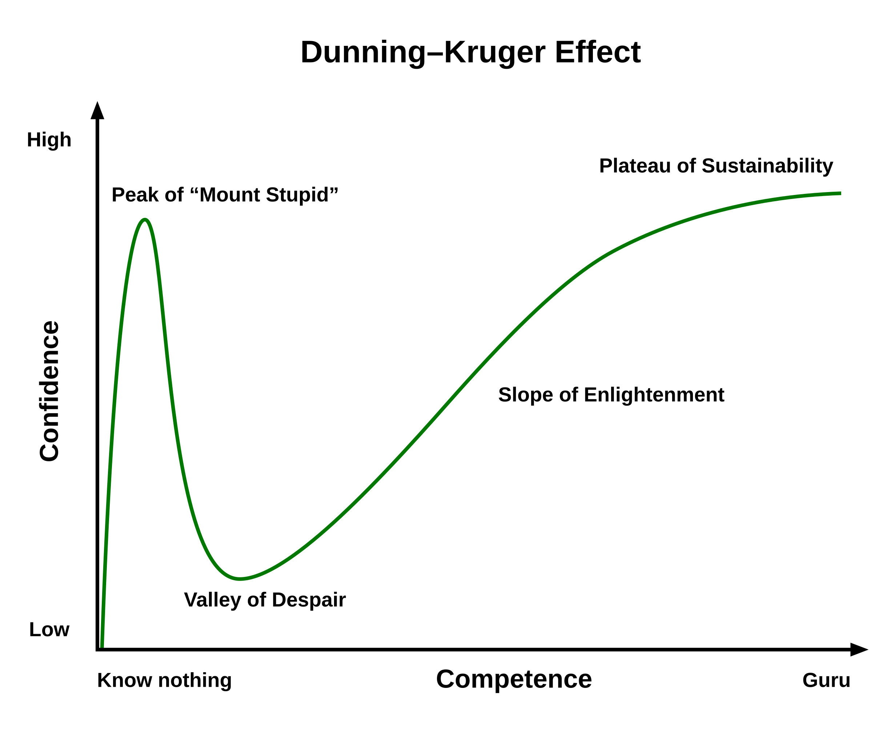
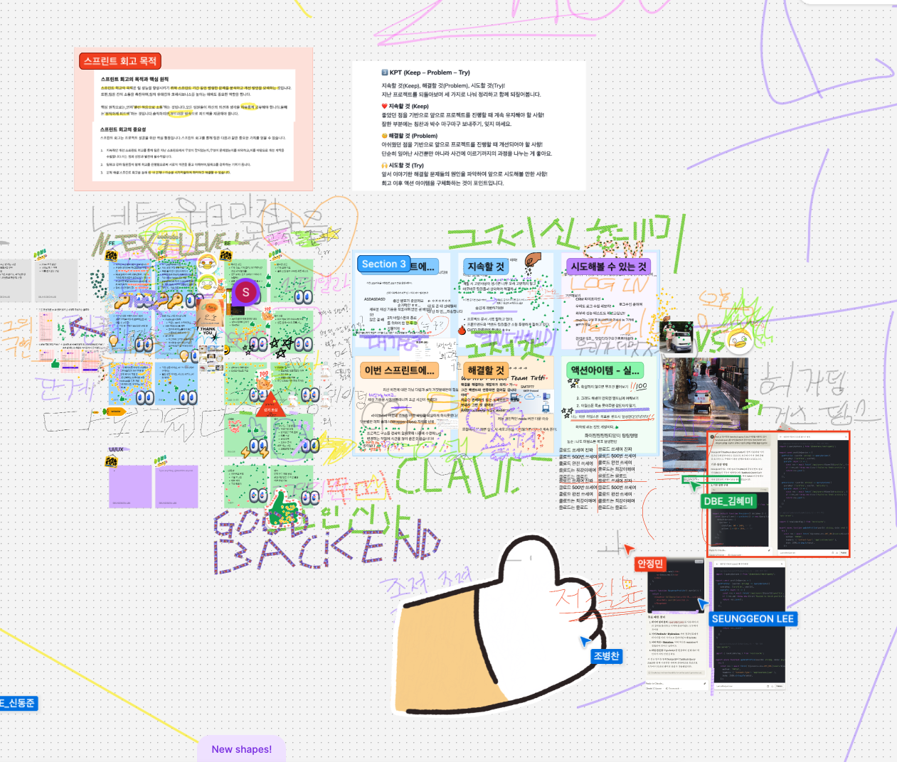
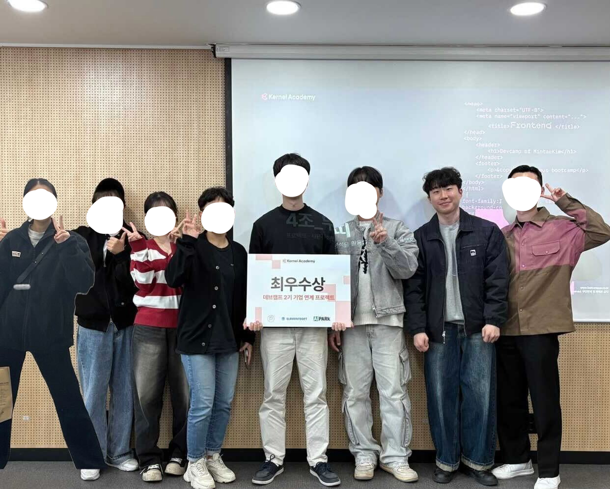

## 기술적 성장, 그 이면의 깨달음

**"아, 정말 내가 무지했구나..."**

부트캠프 시작 전, 나는 HTML, CSS, JavaScript를 '안다'고 생각했다.
그러나 Vanilla JavaScript로 직접 프로젝트를 해보며 충격적인 진실과 마주했다.
아는 것과 할 수 있는 것은 완전히 달랐다.
이것이 바로 `Dunning-Kruger Effect`를 직접 경험한 순간이었다.

처음에 나는 그래프의 왼쪽, '**우매함의 봉우리**'에 있었다.
HTML 태그를 조금 알고, CSS로 간단한 스타일링을 할 수 있으며, JavaScript로 기본적인 동작을 구현할 수 있다는 이유로 내가 좀 안다고 착각했다.
그러나 실제 프로젝트를 시작하자 그래프가 급격히 하락하는 '**절망의 계곡**'으로 빠르게 미끄러져 내려갔다.

"이렇게 간단한 기능도 구현하지 못하네?", "왜 React가 아닌 Vanilla JavaScript에서는 이렇게 해야 하지?", "다른 사람은 어떻게 하지?"

코드를 작성하는 순간마다 내 지식의 깊이가 얼마나 얕았는지 마주하게 되었다.
SPA로 만들려고 하다보니 코드를 React스럽게 짜기 위해 노력했다.
React에서는 간단하게 구현할 수 있는데 Vanilla JavaScript에서 하려니 너무 막막했다.
이것이 바로 더닝-크루거 효과의 '**절망의 계곡**'이었다.

그러나 이 경험은 단순한 좌절감을 넘어 중요한 가치가 있었다.
이 과정에서 나는 개발이란 끊임없이 자신의 한계를 인정하고 확장해 나가는 여정이라는 것을 깨달았다.
내가 모르는 것이 얼마나 많은지 인식하는 순간, 비로소 진정한 학습이 시작되었다.

천천히, 그래프의 오른쪽으로 나아가기 시작했다. React와 Git을 더 깊이 공부하면서, 코드는 단순한 명령어의 나열이 아닌 하나의 언어라는 것을 이해했다.
좋은 코드란 무엇인지 고민하게 되었고, 클린 코드를 작성하려는 노력은 단순히 기능 구현을 넘어 코드와 소통하는 방식을 바꿔놓았다.

더닝-크루거 그래프의 우측, '**깨달음의 슬로프**'를 오르며 나는 또 다른 중요한 통찰을 얻었다.
기술 자체보다 그 기술을 선택하는 철학과 맥락이 더 중요하다는 것이다.
Tailwind CSS를 고수했던 내가 Styled-components를 도전하면서 느낀 것은, 도구는 달라도 추구하는 가치는 같았다는 점이었다.

이제 나는 '**지속가능성의 고원**'을 향해 나아가고 있다.
아직 도달하지는 못했지만, 적어도 내가 얼마나 모르는지는 명확히 알게 되었다.
최종 프로젝트에서 Next.js를 사용하며 깨달은 것은, 기술 스택이 아니라 문제 해결 능력이 진정한 개발자의 역량이라는 점이었다.
새로운 기술을 습득하는 것보다, 그것을 통해 어떤 문제를 어떻게 해결할 수 있는지에 대해 고민하는 시간이 값졌다.

더닝-크루거 효과는 단순한 심리학 이론이 아니라, 개발자로서의 여정 그 자체를 설명하는 그래프였다.
우리는 모두 이 곡선을 따라 움직이며 성장한다.
중요한 것은 '**절망의 계곡**'에서 포기하지 않고, 꾸준히 '**깨달음의 슬로프**'를 오르는 인내와 열정이다.

나는 이제 내가 얼마나 모르는지 알게 되었고, 그것이 가장 큰 성장이었다.
이것이 바로 더닝-크루거 효과의 역설이다.
더 많이 배울수록 내가 얼마나 모르는지 더 분명히 깨닫게 된다.
그리고 그 깨달음이 진정한 전문가의 시작점이 아닐까 싶다.

## 제약 속에서 피어난 창의성

최종 프로젝트는 큰 도전이자 배움의 장이었다.
토이 프로젝트의 자유로움과 달리, 디자이너와 백엔드 개발자의 요구사항이라는 제약 속에서 개발을 했다.

이 과정에서 깨달은 것은, 창의성이란 무한한 자유 속에서가 아니라 오히려 제약 속에서 더 빛난다는 점이었다.
데이터 구조에 맞추려고 고민하고, API를 어떻게 활용할지 고심하면서 오히려 더 깊은 사고를 하게 되었다.

'이 데이터 구조가 정말 최선일까?', '사용자 경험을 위해 어떤 방식이 더 나을까?', 'API 수정 요청을 드려볼까?' 이런 질문들은 단순한 기능 구현을 넘어, 서비스의 본질에 대해 고민하게 만들었다.

토이 프로젝트 후의 번아웃과 달리, 최종 프로젝트는 지금도 계속 발전시키고 싶은 마음이 드는 이유인 것 같다.
그저 과제가 아닌, 진정한 가치를 만들어내는 작업이었기 때문이다.

## 성장의 의미

기술적 성장에서 가장 큰 깨달음은 '어떻게'도 중요하지만 '왜'에 있었다.
클린 코드를 위한 컴포넌트 분리를 고민하고, 코드의 철학에 대해 생각하게 되었다.

불필요한 코드를 정리하고 단순히 라인 수를 줄이는 과정은 기술적 최적화가 아니었다.
그것은 복잡성을 다루는 사고방식의 변화였다.
코드가 단순해질수록 사고는 깊어진다는 역설을 경험했다.

LCP 시간을 75% 단축시키면서 느낀 것은, 기술이란 결국 사람을 위한 것이라는 점이었다.
최적화된 코드 한 줄이 누군가의 몇 초를 절약해주고, 그 작은 변화가 전체 사용자 경험을 바꿀 수 있다는 사실에 나에게 울림을 줬다.

성능 최적화를 위해 팀원이 제시한 서버 캐싱와 axios의 필요성에 대한 논의를 하면서, 기술적 결정이 단순한 선택이 아니라 서비스의 방향성을 결정짓는 중요한 요소라는 것을 깨달았다.

최적화를 하면서 나는 단순하게 UI만 고려하는 것이 아닌, 문제를 해결하고 UX까지 고려하는 개발자로 성장하고 있음을 느꼈다.
코드의 표면이 아닌, 그 이면의 의도와 영향을 고민하게 된 것이다.

## 협업, 인간관계의 기술

모든 프로젝트는 팀 단위로 이루어졌고, 이는 내게 개발이 결국 사람과의 협업이라는 깊은 통찰을 주었다.

백엔드와 API 명세서를 맞추고, 디자이너와 데일리 미팅을 하면서, 기술적 소통 너머의 인간적 이해가 얼마나 중요한지 배웠다.
우리는 코드를 통해 소통하지만, 결국 그 코드를 작성하는 것은 사람이라는 점을 매순간 상기하게 되었다.

트러블도 있고 화나는 순간도 있었지만, 그것이 오히려 성장의 촉매제엿다는 것을 이제는 알게 되었다.
완벽한 협업이란 트러블이 없는 것이 아니라, 트러블을 통해 서로를 더 깊이 이해하게 되는 과정이다.

"소통이 많을수록 트러블도 많아진다"는 말은 역설적이지만 진실이다.
그리고 그 과정에서 우리는 더 단단한 팀이 되어갔다.
코드의 충돌보다 더 복잡하고 미묘한 인간관계의 충돌을 해결하며, 진정한 협업의 의미를 배웠다.

GitHub를 통한 협업 과정에서도 많은 것을 배웠다.
브랜치 전략을 세우고, 충돌을 해결하고, 코드 리뷰를 통해 서로의 코드를 개선해 나가는 과정은 단순한 기술적 절차가 아닌 팀의 문화를 형성하는 과정이었다.

특히 최종 프로젝트에서는 매주 진행했던 이벤트가 있었다.

**마일스톤 회고**는 일주일간의 스트레스가 풀리는 듯한 느낌을 주는 소중한 시간이었다.
이 회고는 단순한 업무 보고가 아니라, 서로의 성장과 발전을 공유하는 자리였다.
차주에는 더 잘해보자는 다짐을 하고 재밌는 농담도 주고받으며 좋은 에너지를 나누는 순간들이 쌓여 팀워크의 기반이 되었다.
이런 정기적인 소통의 시간을 통해 우리는 **기술적 성장뿐만 아니라 정서적 유대감도 함께 키워**나갔다.

## 한계 상황에서의 성장

프로젝트의 촉박한 시간은 늘 우리를 압박했다.
토이 프로젝트는 3주라는 짧은 시간동안 기획부터 디자인, 발표까지, 정말 불가능해 보이는 일정이었다.

그러나 이 경험은 내게 시간의 제약이 오히려 집중력과 효율성을 높인다는 깨달음을 주었다.
'일주일이 더 있었으면...'이라는 생각은 사실 환상일지도 모른다는 것을 깨달았다.
인간은 마감이 닥쳐야 비로소 잠재력을 발휘하는 존재인지도 모른다.

이 과정에서 나와 팀원들은 우리의 한계를 넘어서는 경험을 했다.
번아웃과 좌절을 겪으면서도, 그것을 극복하는 회복 탄력성을 배웠다.
개발자의 여정은 기술적 도전뿐만 아니라, 자신의 한계와 싸우는 내적 여정이기도 하다는 것을 깨달았다.

프로젝트 중간에 특강과 PPT 제작 같은 추가 업무들은 당시엔 짐처럼 느껴졌지만, 지금 돌아보면 그것들이 오히려 프로젝트를 더 견고하고 단단하게 만들어주었다는 것을 알게 되었다.
때로는 한 걸음 물러서서 바라보는 시간이 필요하다는 것을 배웠다.

특히 어려운 기술적 문제에 막혔을 때, 밤을 새워 해결책을 찾은 경험들이 값진 성장의 순간이었다.
디버깅의 고통스러운 과정이 가장 큰 배움을 가져다준다는 것을 깨달았다.

## 마침표가 아닌 쉼표, 또 다른 출발점

7개월의 부트캠프 여정을 마치며, 이것이 끝이 아닌 시작임을 느낀다.
처음에는 '과연 해낼 수 있을까'라는 의문이 있었지만, 지금은 '앞으로 무엇을 더 해낼 수 있을까'라는 기대로 바뀌었다.

부트캠프는 단순한 기술 교육 과정이 아니었다.
그것은 개발자로서의 정체성을 형성하는 여정이었다.
강의를 통해 배운 것도 물론 있지만, 팀원들과 밤 새우며 문제를 해결하고, 서로의 코드를 리뷰하면서 배운 것들이 더 값졌다.

학교와 병행하며 정말 힘든 시간이었지만, 그 시간들이 내게 준 가치는 측정할 수 없을 만큼 크다는 것을 알게 되었다.
스스로를 밀어붙이지 않았다면 결코 경험하지 못했을 성장이었다.

수료 전 날, '**해방**'이라는 단어를 쓰며 해방감을 표출했는데, 사실 이는 성장을 위한 구속이었던 시간이었다.
역설적이게도, 그 구속 안에서 우리는 더 자유롭게 성장할 수 있었다.
부트캠프라는 틀 안에서 강제로 몰아붙였기에 이룰 수 있었던 발전이었다.

개발자로서 기술적 역량뿐만 아니라, 문제 해결 능력과 협업 능력을 동시에 성장시킬 수 있었다.
특히 새로운 기술 스택을 도전해보면서, 이 기술 스택을 어떻게 잘 사용해볼 수 있을지에 대해 행복한 고민거리가 늘게 되었다.

이제 이 틀을 벗어나 더 넓은 세계로 나아갈 준비가 되었다.
부트캠프에서 배운 것은 단순한 기술이 아니라, **꾸준히 배우고 성장하는 자세**, **문제를 해결하는 사고방식**, 그리고 **함께 일하는 협업의 가치**였다.

지금까지 함께한 모든 분들께 진심으로 감사드립니다. 팀원들, 강사님, 멘토님, 매니저님 모두가 이 여정의 소중한 일부였다.

마지막으로 함께했던 부트캠프 동기들 및 취준생에게 말씀 드리고 싶다.

:::info{title="부트캠프 동기들 및 취준생에게"}
"사소한 문제들이 모여 큰 산이 되기도 하지만, 그 산을 함께 넘어가는 과정에서 우리는 정말 놀라운 성장을 이뤘어요.

복잡한 코드의 미로를 헤쳐 나가며, 때로는 밤을 지새우고, 때로는 답답함에 좌절하기도 했지만, 결국 우리 모두 개발자로서 한 단계 더 성숙해졌어요.

개발이란 단순한 코딩이 아니라, 문제를 이해하고, 해결책을 설계하고, 그것을 실현하는 창조적 과정임을 깨달았어요.
그 과정에서 우리는 코드뿐만 아니라, 자신과 타인에 대해서도 더 깊이 이해하게 됐어요.

앞으로도 수많은 도전이, 그리고 그만큼의 성장 기회가 기다리고 있겠지만, 이미 우리는 증명했어요.
**어떤 문제든 함께라면 해결할 수 있다는 것을.**

오늘의 고민이 내일의 지혜가 되어, 더 나은 코드와 더 나은 서비스를 만들어 갈 우리의 여정을 축하하고 응원합니다!"
:::

감사합니다!👋
