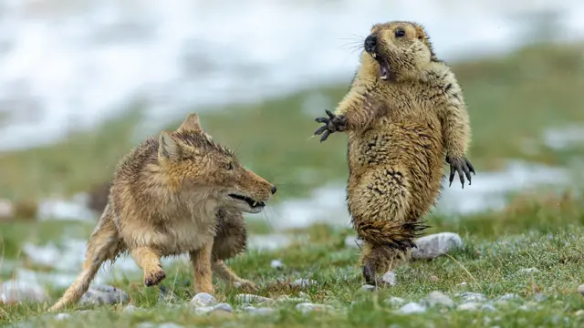
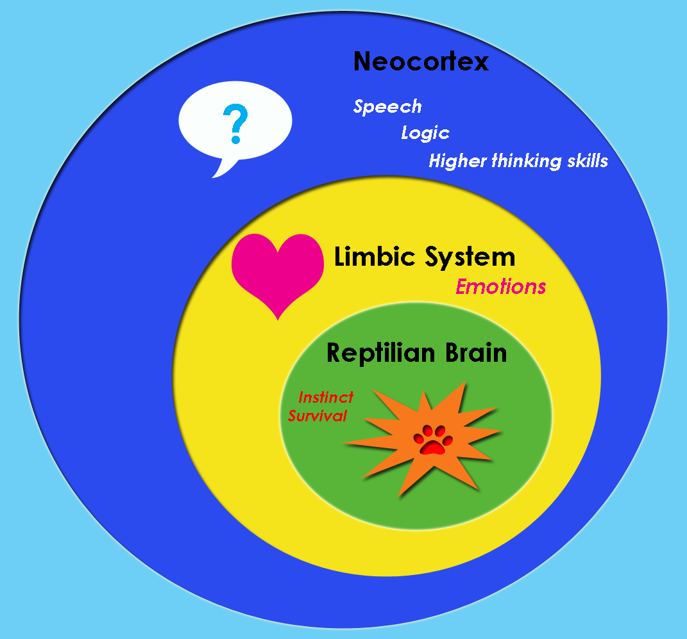

우리는 왜 이토록 취업이 어려운 시대를 살고 있을까?
오늘 들은 **송요창 강사님**의 **'불확실의 시대: 생존전략' 특강**에서 **야생 학습**이라는 개념을 접하고 깊은 생각에 잠겼다.

## 도마뱀뇌의 경고

나 포함 취준생은 매일 수십 개의 채용공고를 확인하고, 이력서를 다듬고, 포트폴리오를 보완하는 일이 일상이 되었다.
이 과정에서 우리의 도마뱀뇌는 끊임없이 **생존**에 대한 불안감을 경고한다.

취업이라는 **사냥**을 위해 더 많은 스킬을 습득하고, 더 나은 프로젝트를 만들어야 한다는 본능적인 압박감이 밀려온다.
이는 원시시대의 인류가 사냥감을 찾아 끊임없이 움직여야 했던 것과 다르지 않은 것 같다.

## 실전에서 마주한 야생 학습

특히 특강에서 들은 **야생 학습**의 개념은 개발자 취준생으로서 더욱 와닿았다.
학교나 학원에서 배운 정형화된 지식을 넘어, 실전에서 마주하는 문제들은 훨씬 더 복잡하고 예측 불가능하다.
마치 야생의 동물들이 실제 환경에서 생존법을 터득해야 하듯, 우리도 실무와 가까운 경험을 쌓기 위해 고군분투한다.

도마뱀뇌의 관점에서 이러한 상황은 지속적인 스트레스를 유발한다.
'안전한 직장'이라는 **안식처**를 찾지 못한 상태에서, 우리의 원시적 뇌는 계속해서 위험 신호를 보낸다.
새로운 기술이 등장할 때마다 느끼는 불안감, 다른 취준생들과의 경쟁에서 오는 압박감, 이 모든 것이 생존 본능과 맞닿아있다.

## 린치핀을 꿈꾸며

하지만 **역설적으로**, 이런 야생의 환경이 우리를 더 강하게 만들 것이다.
정형화된 교육 과정에서는 배울 수 없는 실전 감각, 문제 해결 능력, 그리고 끊임없는 학습 능력을 기르게 된다.
야생에서 살아남은 동물들이 더 강한 생존력을 갖게 되듯, 이 과정을 통과한 우리도 더 단단한 개발자로 성장할 수 있다.

특히 개발자 취준생으로서 가장 어려운 건, 실무 경험의 부재다.
이는 마치 야생 동물이 보호된 환경에서 자연으로 돌아가는 순간과도 같다.
아무리 많은 사이드 프로젝트를 진행해도 실제 서비스를 운영해본 경험과는 분명한 차이가 있을 것이다.
**도마뱀뇌는 이런 불확실성 앞에서 더욱 강한 생존 본능을 자극한다.**

하지만 우리의 뇌는 도마뱀뇌만으로 구성되어 있지 않다.
더 발달된 **변연계**와 **신피질**은 이러한 상황을 더 넓은 관점에서 바라볼 수 있게 해준다.
단순한 생존을 넘어, 이 과정에서 얻는 배움의 가치, 성장의 기쁨, 그리고 미래에 대한 희망을 발견할 수 있게 해준다.

취업이 어려운 건 분명한 현실이다.
하지만 야생의 환경에서 생존하는 법을 배우고, 도마뱀뇌가 보내는 경고 신호를 우리의 발전 동력으로 삼을 수 있다면, **이 시기는 단순한 고통의 시간이 아닌 값진 성장의 기회**가 될 것이다.

나는 이런 도마뱀뇌에서 나오는 불안과 두려움, 이상한 생각들을 극복하고자 **린치핀이 되기로 결심했다.** '**누구도 대체할 수 없는 존재가 되라**'는 린치핀의 메시지처럼, 단순한 생존을 넘어 진정한 가치를 만들어내는 개발자가 되고 싶다.

언젠가 이 시기를 돌아볼 때, 야생에서의 생존 훈련과도 같았던 이 시간들이 우리를 더 탁월한 개발자로 만들어주었다고 자신있게 말할 수 있기를 바란다.
