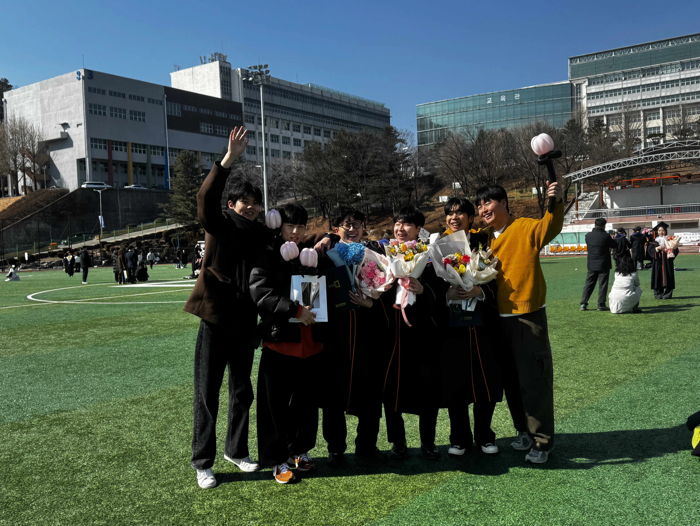
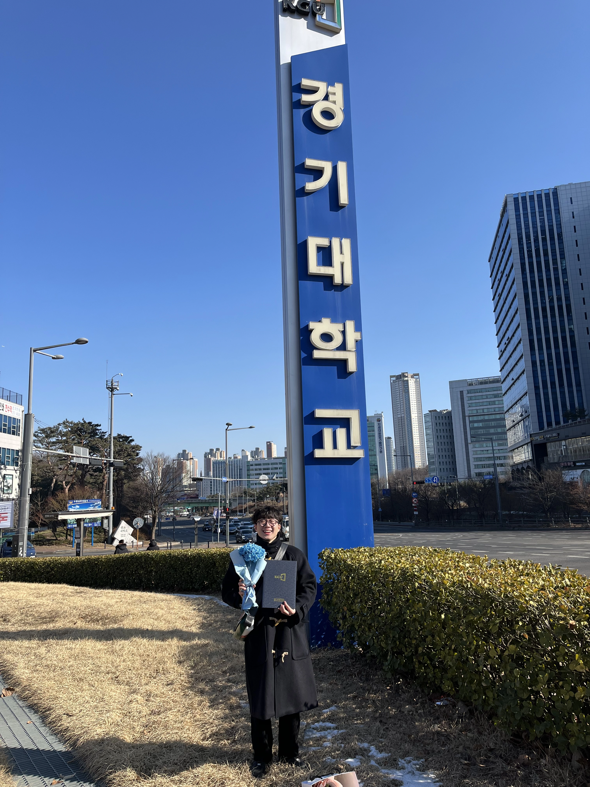

## 학생에서 무신분으로

졸업장을 보며 문득 생각했다. **고작 이 종이 한 장 받으려고 4년을 고생했네.**

나는 이제 더 이상 **대학생이 아니다.**

지금 쓰고 있는 글이 술 마시고 쓴 글처럼 주접일 수 있다. 하지만 절대적으로 **맨정신**이다.

졸업장을 받고 학사모를 던지며 내 대학 생활을 모두 날려버렸다.
학위복을 입고, 학사모를 쓰고 수많은 사진을 찍고, 동기들과 술 한 잔하며 모두의 졸업을 축하했다.
마치 **군대에서 전역하듯**, 오랜 의무감에서 해방되는 기분이 들었다.
막상 졸업을 하고 집에 돌아와 찍었던 사진들을 되돌아보며, 졸업증을 보는데 밀려오는 감정은 도대체 뭘까?

군대에서 전역하고 나서는 정말 행복했다. 전역한 느낌과 비슷한데 되게 다른 느낌이다.
전역 후에는 군대에 있는 동안 못했던 것들을 하며 즐겼고, 복학하면 또 다시 '학생'이라는 신분이 나를 반길 것이라는 **안정감**이 들었다.

하지만 졸업은 다른 것 같다. 나는 더 이상 취업 전까지 신분이 없으며 '**취준생**'이 되었다.
4년 내내 나를 정의해줬던 '대학생'이라는 정체성이 하루 아침에 사라져버렸다. 이제 나는 그저 '취준생'이라는 **빈칸**이 됐다.

항상 시간표를 확인할 필요도, 과제 제출 마감일에 쫓길 일도 없다.
이 **자유**가 왜 이렇게 무겁게 느껴지는 걸까? 그토록 바라던 졸업인데, 이제 와서 보니 의무와 책임이 주는 일상의 확실함이 그리운 것 같다.

## 추억과 현실 사이

사실 3, 4학년 때부터 졸업하면 무얼 할 지 정말 **많은 고민**을 했다. 내 미래는 과연 어떨지, 졸업하면 나는 무엇을 하고 있을지.
그 때는 큰 꿈과 계획으로 가득 찼었다.
하지만 현실은 전혀 화려하지 않았다. 지금 나는 토이 프로젝트를 하며, 그저 취업을 위해 취업 공고를 계속 들여다보고 있다.

돌이켜보면 내가 했던 고민들조차 **행복했던** 것 같다. 교수님의 강의에 졸던 순간, 시험 기간의 **긴장감**, 성적을 확인하는 **떨림**들도 이제 추억으로 남았다.
동기들은 졸업을 앞둔 나에게 종종 물었다. "졸업하면 뭐할건데? 유예하면 신분이 주는 안정감이 있잖아." 라고.

그런 질문을 들을 때마다 나는 망설임 없이 "무조건 졸업하지!"라고 답했다.
당시에는 그저 빨리 학교를 벗어나고 싶었던 마음이 컸지만, 지금 생각해보면 '대학생'이라는 신분으로 **도피하고 싶지 않았던** 것 같다.
도피하면 무엇이 달라질까? 무엇이 더 나아질까? 결국 도피하지 않고 무신분을 택했다.

하지만 졸업이 현실이 되고 나니, 문득 대학 생활의 소소한 순간들이 그리워진다.
캠퍼스를 힘들게 오르내리며 봤던 계절의 변화, 도서관에서 열공하던 순간들, 동기들과 나눴던 고민들과 웃음들.
불과 몇 달 전까지는 일상이었던 것들이 이제는 **추억**이 되었다.
그 시간들이 때로는 지루하고 버거웠지만, 지금 생각하면 그 순간이 내 삶을 구성하는 **소중한 조각들**이었다.

연락이 뜸해지는 친구들이 있을 거고, 각자 다른 길을 찾아가는 동기들이 있을 것이다.
함께했던 시간이 끝났다는 사실이 마음 한 구석을 **허전**하게 만든다.
공유했던 목표, 경험, 고민들, 서로를 응원했던 연대감이 이제는 희미해진다.
하지만 그것이 인생의 흐름이라는 것은 반박할 수 없는 사실이다.

## 새로운 시작을 위한 공백

도피하지 않고 졸업을 선택한 **자신감**은 좋았지만, 이에 따르는 공허함이라는 대가는 예상하지 못했다.
이제 와서 생각해보니, 이 공허함도 내 선택의 일부로 받아들여야 한다.
사실 이 공허함을 **긍정적으로** 바라볼 수 있지 않을까.
이제 내 앞에는 **무한한 가능성**이 펼쳐져 있다.
이는 축복이자 동시에 부담일 수 있다. 나는 어떤 사람이 되고 싶고, 어디로 가야 하며, 모든 선택과 책임은 전적으로 내 것이 됐다.
'대학생'이라는 신분에 갇혀 있지 않고, 새로운 일을 하기 위한 **발판**에 서 있는 셈이다.

저번주를 기점으로 대학생은 끝났지만, 나는 여전히 **나**고 인생은 계속된다.
전역 후에 다시 복학하며 적응했던 것처럼, 나는 또 다시 새로운 **정체성**을 찾아갈 것이다.
취업을 향한 여정이 때때로 지치고 막막할 수 있지만, 이 과정에서 나는 분명 더 나은 사람이 되기 위한 **배움**과 **성장**이 있을 것이다.

어쩌면 공허함은 채워질 준비가 된 **빈 공간**일지도 모른다. 내가 앞으로 만들어가는 일상과 새로운 관계, 목표로 채워질 공간.

가끔은 아무것도 하지 않고 그냥 침대에 누워서 천장을 바라보곤 한다. 4년 동안 달려온 나에게 주는 **작은 선물**이라고 생각한다.
이 시간이 길어질수록 불안감이 커지기도 하지만, 이 **과도기적 시간**이 앞으로의 삶을 더 견고하게 만들어주지 않을까?

취업 공고를 보면서도 내가 진정으로 원하는 것이 무엇인지 **깊게 생각**해볼 수 있는 시간.
대학 생활 내내 바쁘게 살아오며 놓쳤던 나 자신과의 대화를 나눌 수 있는 **소중한 기회**일지도 모른다.

이런 말이 있다. "**어제의 나**와 작별하고, **오늘의 나**를 받아들이며, **내일의 나**를 기대하는 마음을 갖자."
이러한 마음으로 졸업 후의 공허함을 받아들이고, 더 나은 시간을 보내기 위해 노력하고자 한다.
전역 같은 이 기분도, 곧 지나갈 테니까.

지금 느끼는 이 **공허함**도 언젠가는 그리워할 날이 올지도 모른다. 오늘 하루 뿐 아니라 며칠 간 이러겠지만, 나는 이 감정을 있는 그대로 느끼기로 했다.
이후의 시간은 또 다른 **시작**이니까.

인생은 끊임없는 **졸업식의 연속**이다. 하나의 챕터가 끝이 나면 새로운 챕터가 시작되는 순간, 우리는 항상 이러한 미묘한 감정 사이에 서게 될 것이다.
이게 성장의 과정이고, 바람같은 인생의 흐름 아닐까? 이 바람같은 흐름에 몸을 맡기며, 다음 인생의 챕터에서 펼쳐질 이야기를 기대한다.
공허함도 내 이야기의 일부일 뿐, 전부는 아니니까!
