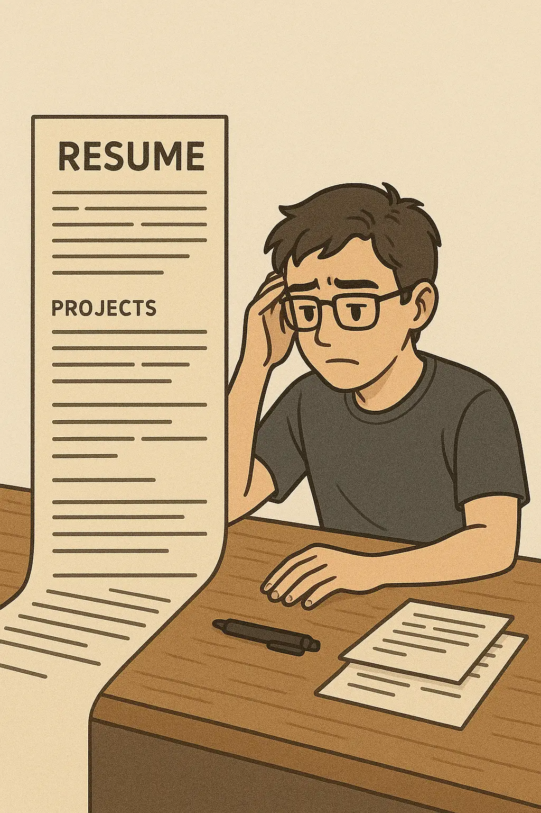
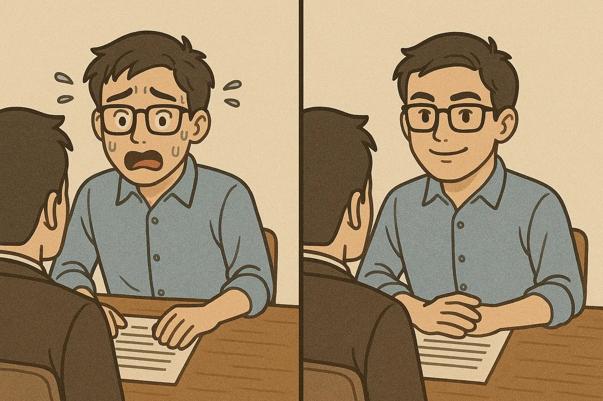
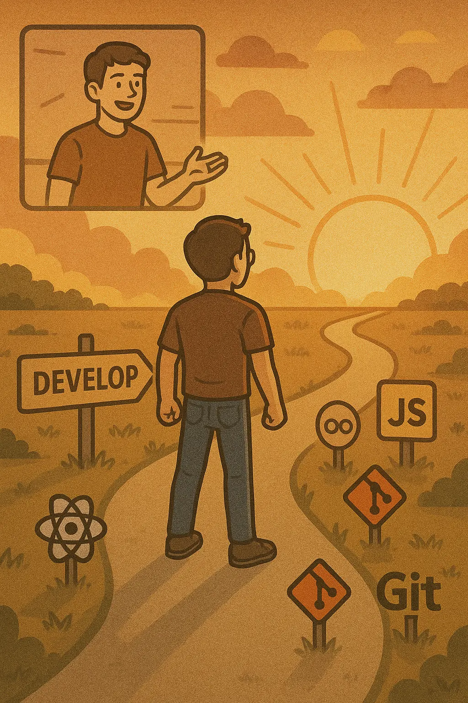

취업을 했다.
유명한 기업 그런 곳은 절대 아니다.
스타트업이다.
하지만 스타트업 환경에서 새로운 문화를 만들며 좋은 시너지를 내면서 성장하고 싶었다.
지금까지 개발을 하며 꿈꿔왔던 목표는 단순했다.
**“판교에서 개발자로 일하고 싶다.”**
초라하지만 길었다면 길고 짧았다면 짧은 내 취업 과정을 돌아보고자 한다.

## 이력서: 0에서 1로

처음에는 누구나 그렇듯 제대로 된 이력서가 없었다.
부트캠프를 시작하면서 작성한 이력서는 정말 길었다.
프로젝트에 대한 내용을 빠짐없이 모두 기입했더니 채용 담당자가 집중하기 어려운 이력서가 되어버렸다.

그땐 정말 잘 쓴 이력서라고 나름 생각했다.
하지만 친구의 피드백으로 너무 길고, 프로젝트가 너무 많다는 걸 깨닫고 다시 줄여나갔다.

### 첫 번째 충격

부트캠프에서 이력서 첨삭 프로그램이 있었다.
내 기준에서 최대한 다듬어진 이력서를 제출했는데, 첨삭 결과는 충격적이었다. (물론 충분히 완성도 있는 이력서라고 하셨다.)

**“너무 기능 중심의 이력서다. 수치화가 중요하다. 굳이 필요하지 않은 내용은 빼고 장점만 어필해라.”**

그때 깨달았다.
**신입이 모든 것을 수치화하기는 정말 어렵다는 걸.**
이때 많이 좌절스러웠다.
‘나는 어떤 개발을 한 걸까?’하고 곱씹었다.
기능 만들기에만 급급했던 것 같았다.
물론 어려운 점도 있었고 트러블 슈팅도 해냈지만, 이를 이력서에 적기엔 너무 길어졌다.

첨삭 멘토님의 말이 인상 깊었다.

**“채용 담당자는 이력서를 보는 데 40초도 걸리지 않는다. 눈에 띄는 이력서를 만들어야 한다. 비개발자인 내가 봐도 ‘이 사람 개발 역량이 대단하다’고 느껴져야 한다.”**

맞는 말이었다.

또 다른 중요한 피드백도 받았다.
신입이라면 소프트 스킬보다 개발 역량을 더 강조하라는 것이었다.
나는 그동안 소프트 스킬을 위주로 썼었다.

솔직히 내 생각에는 신입 개발자들 간의 하드스킬 차이는 크지 않을 것이라고 판단했다.
모두가 비슷한 기초 스택 지식을 갖추고 있을 테고, 기업들도 신입에게 고도의 기술력을 요구하지는 않을 거라 생각했다.
**"차별화를 위해서는 오히려 소프트 스킬이 더 중요하지 않을까?"** 라는 판단으로 소통 능력, 팀워크, 문제 해결 접근법 같은 소프트 스킬을 더 어필했던 것이다.

하지만 멘토님의 피드백은 정반대였다.
신입일수록 오히려 개발 역량의 깊이와 열정을 보여주는 것이 중요하다는 것.
모두가 비슷한 기초 지식을 가졌다고 생각하는 그 순간에, 조금이라도 더 깊이 파고든 사람이 경쟁에서 앞서나간다는 의미였다.
이 조언은 내 접근법을 다시 생각하게 만들었다.

### 참담한 결과

첨삭받은 이력서로 잡코리아, 사람인, 원티드에 지원했다. 결과는 참담했다. 한 군데서도 연락이 오지 않았다.

물론 현재 취업 시장이 어려운 건 사실이다.
하지만 그래도 서류조차 합격하지 못할 정도였을까?
서류 합격을 위해서는 도대체 얼마나 빛나는 이력서가 필요한 걸까?

이제 와서 보면 그 이력서는 정말 많이 부족했다.

### 전문가 첨삭

최근 링크드인을 자주 보는데, 어느 날 프론트엔드 이력서 첨삭 글이 올라왔다.
현직 채용 담당자이면서 개발자, 마케터로 다양한 경험을 쌓으신 분이다.
서둘러 DM을 보냈다.

약 이틀 후, 체계적인 분석과 피드백이 도착했다.
내 문제점이 무엇인지, 어떻게 하면 돋보이는 이력서가 될지 구체적으로 알려주셨다.
자기소개서도 수정할 부분이 정말 많았다.

**"이력서는 단순한 경력 나열이 아닌, 채용 담당자를 설득하는 제안서입니다.
여러분이 왜 그 자리에 적합한지, 어떤 가치를 팀에 가져올 수 있는지를 보여주는 마케팅 도구라고 생각하세요."**

또한 소프트 스킬에 대한 내 접근법이 틀리지 않았음을 확인받았다.

**"기업들은 단순히 기술적 역량만 뛰어난 사람보다 팀에 조화롭게 어울리고 긍정적인 영향을 미칠 수 있는 인재를 원합니다.
특히 스타트업에서는 이러한 요소가 더욱 중요하게 평가됩니다."**

그러면서도 **"기술적 역량은 기본이고, 그 이상의 가치를 보여주세요"** 라는 조언을 주셨다.

가장 중요한 깨달음은 **단순 경험 나열이 아니라, 내가 무엇을 고민했고 이를 어떠한 비즈니스적 가치로 풀어냈는지가 중요하다는 것**이었다.
**"영업사원이 제품을 판매하듯, 여러분 자신을 팔아야 합니다."** 라는 말씀이 계속 머릿속에 맴돌았다.

다른 지원자들이 기능 나열에 그친다면, 나는 그 기능이 가져온 가치와 함께 팀에 어떤 긍정적인 영향을 미칠 수 있는지 보여줄 수 있게 된 것이다.

### 변화의 결과

전문가 피드백을 바탕으로 이력서를 전면 수정했다.
기존 템플릿으론 한계가 있어서 피그마로 직접 디자인해서 사용했다.

이번에는 기술적 역량을 기본으로 보여주면서도, 각 프로젝트에서 내가 가져온 비즈니스적 가치와 팀 내에서의 협업 경험을 강조했다.
제품을 사용자 관점에서 개선한 경험, 팀원들과 소통하며 문제를 해결한 과정, 그리고 그 결과로 얻은 성과를 명확하게 제시했다.

훨씬 깔끔하고 역량이 강조된 이력서가 완성됐다.
이 새로운 이력서로 지원하니 확실히 달랐다.
**이력서 열람율이 늘고 서류 합격 연락도 오기 시작했다.**
기하급수적인 변화는 아니었지만, 기존 0건에서 몇 건으로 늘어난 것만으로도 큰 성장이었다.

드디어 서류를 통과했으니, 이제 면접 준비를 시작할 차례였다.
이력서 개선 과정에서 배운 '가치 중심의 표현법'과 '기술적 역량과 소프트 스킬의 균형'은 면접에서도 큰 도움이 됐다.

## 면접 과정: 무지에서 성장으로

살면서 면접 본 경험이 거의 없었다.
대학 입학 면접과 산호세 SW 하계 프로그램 면접이 전부였기에, 개발자 면접은 내게 큰 도전이었다.
예상대로 면접은 가장 큰 복병이었고, 첫 면접을 앞두고 많은 긴장감을 느꼈다.

### 체계적인 준비

지원한 회사들의 면접 프로세스는 제각각이었다.
단계가 하나인 곳도 있었고, 1차-2차-임원 면접까지 여러 단계로 구성된 곳도 있었다.
그중 3단계 면접 프로세스를 가진 회사에 첫 면접 기회가 찾아왔다.

면접 준비는 두 가지 방향으로 진행했다.

1. **기술 면접 준비**: 개발자 면접 질문을 구글링하며 자료를 모았고, ‘리액트 인터뷰 가이드’ 책을 정독했다. 프론트엔드 개발자로서 JavaScript, TypeScript, React, Next.js, CS 위주로 질문을 예상하고 답변을 준비했다.
2. **인성 및 경험 면접 준비**: 자기소개와 회사별 지원 동기를 작성하고, 이력서 기반으로 예상 질문을 만들어 답변을 준비했다.

준비 과정에서 깨달은 것은, **모든 답변을 완벽하게 암기하는 것보다 핵심 키워드를 중심으로 이해하고 자연스럽게 문장을 구성하는 능력이 중요하다는 점**이었다.
면접장에서는 준비한 대로 말이 나오지 않는 경우가 많았기 때문이다.

### 면접장에서의 현실

첫 면접은 긴장의 연속이었다.
하지만 여러 질문을 받으며 점차 편안함을 느끼게 됐고, 내 경험을 바탕으로 질문에 대답하는 것이 수월해졌다.

가장 어려웠던 면접은 CTO와의 일대일 면접이었다.
기술에 대한 ‘꼬리에 꼬리를 무는 질문(꼬꼬무)’에 제대로 답변하지 못하면서 내 지식의 한계를 명확히 느꼈다.
그 때 깨달았다.
**단순히 개념을 아는 것과 그것을 명확하게 설명할 수 있는 것은 완전히 다른 차원의 문제라는 것을.**

또한, 네트워크 질문이 나왔을 때 당황했다.
프론트엔드 위주의 질문을 준비하다가 갑작스런 네트워크 질문에 머리가 하얘지고 답변을 할 수 없었다.
컴퓨터공학을 전공하면서 네트워크 과목을 수강했지만 갑자기 질문받으니 당황했다.
망각하고 있었던 것이다.
**개발을 하면서 네트워크는 정말 필수 지식이라는 것을.**

이 경험을 통해 네트워크 기초지식부터 TCP/UDP, 브라우저 동작 원리까지 다시 공부하며 면접 준비 범위를 넓혔다.
프론트엔드 개발자라도 전체 시스템에 대한 이해가 필요하다는 것을 다시 한번 깨달았다.

### 숫자로 본 취업 여정

지원한 기업을 모두 합치니 약 100개였다.
잡코리아, 사람인, 원티드, 공채 및 자사 사이트를 통해 지원했고,

- 면접 제안: 7곳
- 실제 면접 참여: 5곳
- 최종 합격: 2곳
- 최종 및 중간 탈락: 3곳

처음에는 7%라는 서류 합격률이 낮게 느껴졌지만, 각 공고당 **평균 300명이 지원하는 상황에서 이 정도 합격률도 상당히 운이 좋은 편**이었다.
취업 시장의 현실을 체감하는 순간이었다.

### 깨달음: 적합성과 도전정신

면접 과정에서 가장 크게 느낀 점은 **'서류 탈락의 이유는 기업과의 적합성 때문'이라는 흔한 조언이 사실**이라는 것이었다.
내가 면접에 합격한 기업들의 JD를 다시 살펴보니, 내 역량과 경험이 가장 잘 일치하는 곳들이었다.
단순히 많은 기업에 지원하는 것보다, 내 강점과 기업의 요구사항이 일치하는 곳에 집중하는 전략이 더 효과적이었다.

또한, **면접을 두려워하지 말자는 것을 배웠다.**
첫 서류 합격 후 면접 일정이 잡혔을 때 솔직히 가고 싶지 않았다.
하지만 이렇게 계속 피한다면 결국 얻는 것도 없고 취업도 영영 못할 것이다.
**'언제까지 피하고만 있을 것인가. 가서 경험하고 질문 내용을 복기해서 나만의 자산으로 쌓아두자'** 라고 생각하며 면접장에 발걸음을 옮겼다.
실패를 두려워하지 않고 경험으로 삼는 태도가 성장의 밑거름이 되었다.

### 값진 면접 피드백

최종 합격한 기업의 면접 마지막에 용기를 내어 면접관들에게 질문했다.
"제 면접 태도에 대해 조언해주실 수 있을까요?"
면접관은 "절대 상처 받지 말고 들으라"고 당부했고, 나는 "어떤 조언이든 감사히 받아들이고 고쳐나갈 생각"이라고 답했다.

그들이 준 세 가지 피드백은 내 면접 스킬뿐 아니라 앞으로의 커뮤니케이션에도 큰 도움이 될 것이다.

1. **비언어적 커뮤니케이션 조절하기**: 긴장할 때 나오는 과도한 손짓은 자신감 부족으로 보일 수 있다. 적절한 제스처는 좋지만, 과한 손동작은 면접관의 집중을 방해하고 말의 전달력을 떨어뜨린다. 더 안정적이고 자신감 있는 태도를 보여주는 것이 중요하다.
2. **스토리텔링의 힘**: 면접관의 질문은 대개 연결되어 있다. 이전 질문에 대한 답변이 다음 질문의 기반이 되도록 일관성 있게 대화를 이어가는 것이 중요하다. 개연성 있는 답변은 면접관에게 스토리텔링처럼 들려 좋은 인상을 남긴다. 이는 단순히 질문에 답하는 것이 아니라, 일관된 흐름을 만들어 나가는 능력을 보여주는 것이다.
3. **확고한 가치관 갖기**: '정답이 없는 질문'에는 평소의 가치관을 바탕으로 진솔하게 답변하는 것이 중요하다. 이는 실시간으로 생각을 정리하는 부담을 줄이고, 평소 깊이 생각하는 사람이라는 인상을 줄 수 있다. 기술적 역량 외에도 개발자로서의 철학과 방향성을 가지고 있다는 것을 보여줄 수 있다.

이 피드백은 단순한 면접 기술을 넘어 전문가로서의 의사소통 방식에 대한 귀중한 조언이었다.

### 선택의 순간

최종적으로 두 곳의 합격 통보를 받았고, **판교에 위치한 스타트업을 선택했다.**
4명의 프론트엔드 개발자 팀에서 새로운 문화를 함께 만들어갈 수 있다는 점이 결정적이었다.
이미 완성된 시스템에 편입되는 것보다, 스타트업에서 기술적 발판을 만들어가는 과정에 동참하고 싶었다.

이 결정은 단순히 취업을 위한 선택이 아니라, 내가 어떤 환경에서 성장하고 싶은지에 대한 깊은 고민의 결과였다.
규모가 크고 안정적인 회사도 좋지만, **내 의견이 더 많이 반영되고 영향력을 발휘할 수 있는 환경을 선택**했다.
새로운 도전이지만, 이곳에서 더 빠르게 성장할 수 있을 것이라 믿었다.

## 취업길에서 얻은 교훈

취업 과정을 통해 단순히 직장을 얻는 것을 넘어 소중한 교훈들을 얻었다.

1. **표현의 중요성**: 무엇을 했는지보다 **어떤 가치를 만들었는지 표현하는 것이 중요**하다. 이력서에서도, 면접에서도 같은 원칙이 적용된다.
2. **도전의 힘**: 면접이 두렵다고 피하지 않고, 경험으로 받아들이는 자세가 결국 성장을 이끌었다. **실패 조차도 배움이 된다.**
3. **지속적인 학습**: 기술적 지식뿐만 아니라 그것을 명확하게 전달하는 능력, 그리고 개발자로서의 가치관까지 갖추는 것이 중요하다.

아직 내가 많이 부족하다는 것을 깨닫고 있다.
면접 과정에서 드러난 내 지식의 빈틈과 설명 능력의 한계는 앞으로 더 채워나가야 할 과제다.
하지만 이제는 두렵지 않다.
끊임없는 자기 계발을 통해 부족한 부분을 채우고, 더 나은 개발자로 성장해 나갈 것이다.

**취업은 끝이 아니라 새로운 시작점이다.**
이제 진짜 개발자로서의 여정이 시작되었다.

:::note{title="실패의 재해석: 나의 한 마디"}
취업 과정에서 특히 인상적이었던 것은 '당장의 실패'가 미래의 성공으로 이어진다는 점입니다.

첫 이력서의 실패가 없었다면 더 나은 이력서를 만들 동기가 없었을 것이고, 첫 면접에서의 당황스러운 경험이 없었다면 더 철저히 준비할 이유도 없었을 것입니다.

어떤 실패도 낭비가 아니라 성장의 디딤돌이 된다는 것을 항상 기억하세요.
저 역시 개발자로서의 여정에서 이 교훈을 계속 마음에 새기고 있습니다.
:::
