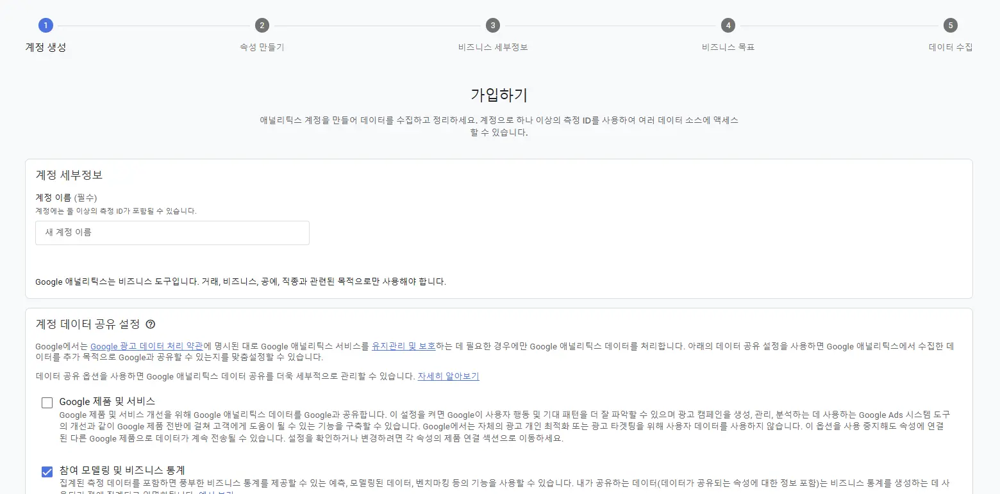
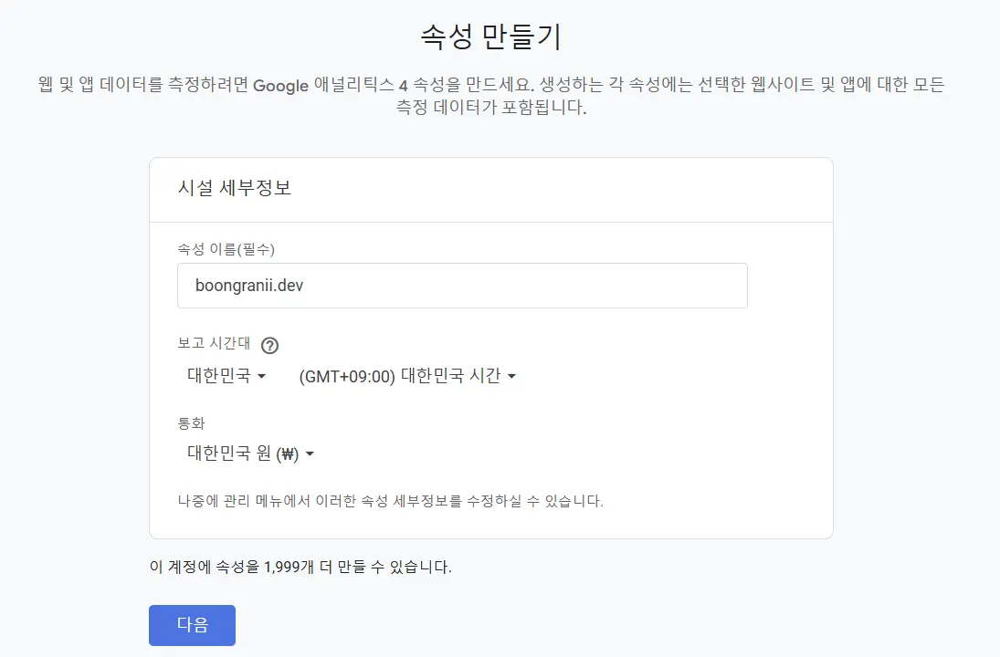
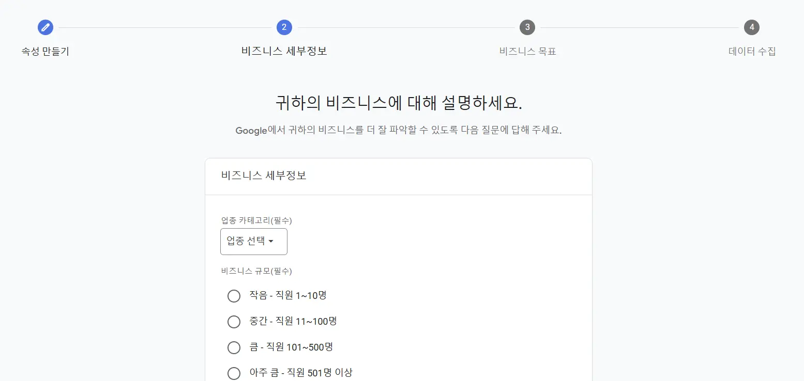
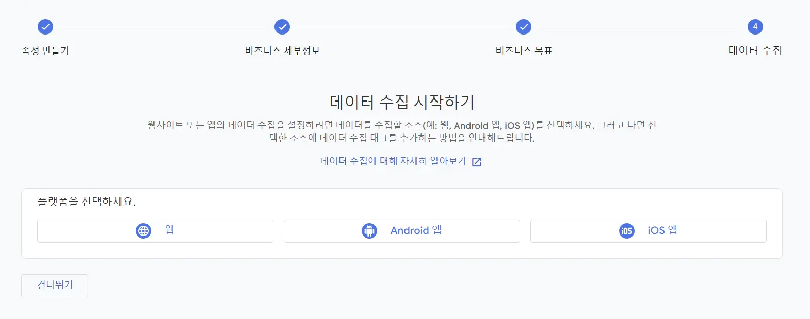
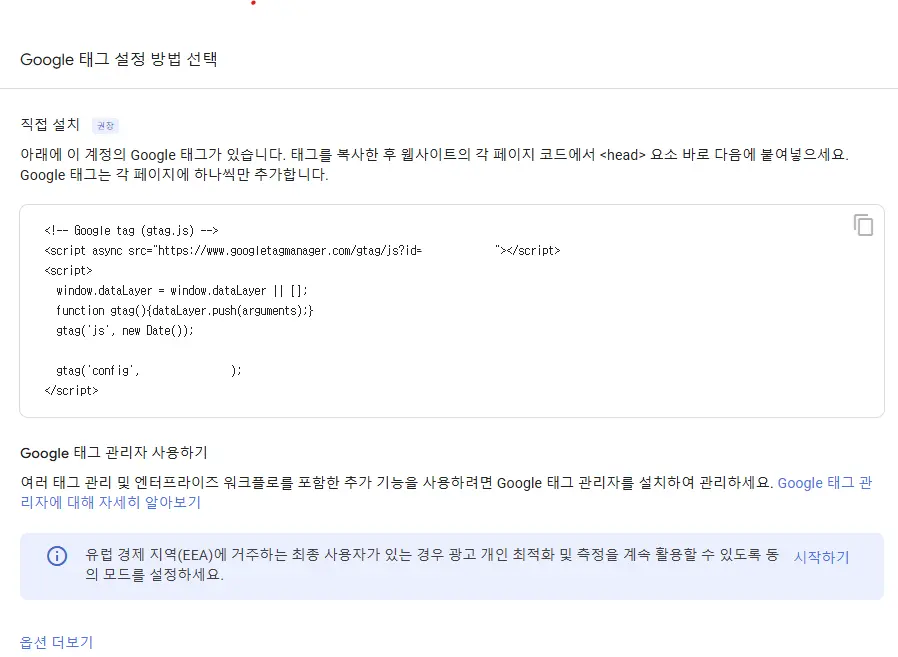
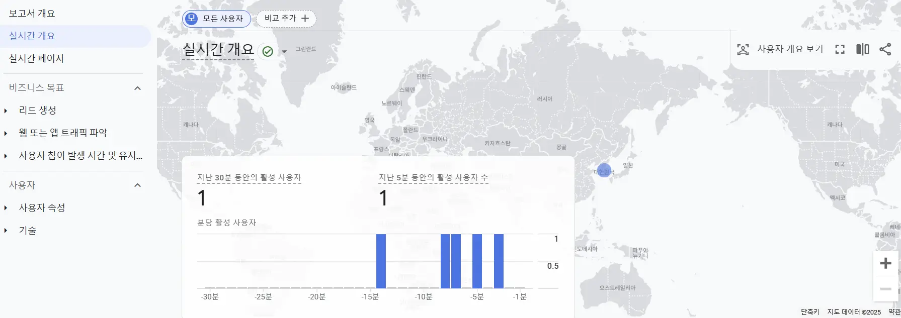

## Google Analytics란?

Google Analytics(GA)는 웹사이트 및 앱의 트래픽과 사용자의 행동을 추적하고 분석하는 구글의 웹 분석 서비스다.
단순히 방문자 수를 세는 것을 넘어서, 사용자가 어떤 경로로 유입되었는지, 웹사이트에서 어떤 행동을 하는지, 얼마나 오래 머무는지 등 상세한 데이터를 수집하고 분석할 수 있다.

## 주요 특징

블로그를 운영하면서 Google Analytics가 제공하는 특징들 중 흥미로운 부분들이 존재했다.

### 실시간으로 방문자 확인하기

지금 이 순간 누군가 내 블로그를 읽고 있는지 실시간으로 확인할 수 있다. 어떤 글을 보고 있는지, 어느 나라에서 접속했는지도 알 수 있다.
처음 블로그를 시작할 때는 이런 실시간 데이터를 보는 재미가 쏠쏠할 것 같은 생각에 도입하기로 했다.

### 글의 반응 살펴보기

방문자들이 어떤 글에 오래 머물렀는지, 어떤 글을 읽고 나서 다음 글로 넘어갔는지 등을 확인할 수 있다.
이를 통해 어떤 주제의 글이 사람들의 관심을 끄는지 파악할 수 있고, 더 많은 사람들이 읽을 수 있는 글을 쓸 수 있을 것 같았다. ~~이렇게 쓰니까 무슨 작가인줄~~

### 방문자 데이터 분석하기

검색엔진을 통해 들어왔는지, 다른 블로그에서 링크를 타고 왔는지 등 방문 경로를 알 수 있다. 특정 기간 동안의 방문자 통계도 볼 수 있어서, 블로그 성장을 지켜보는 재미도 있을 것 같았다.

## 도입한 이유

물론 처음 블로그를 시작하는 내 글을 많은 사람들이 보지 않을 것이란 걸 알고 있다.
**그래도,, 그래도,, 아무도 안 보면 어때. 나 혼자 글 쓰면 되지.**


하지만 Google Analytics를 적용하면서 든 생각은, 단 한 명이라도 내 글을 읽는 사람이 있다면 그들이 어떤 글에 관심을 보이는지, 어떤 페이지에서 불편함을 느끼는지 알 수 있다는 점이다.

사실 다른 기술 블로그들과 경쟁이 될 거라고 생각하진 않는다.
그저 가끔 대시보드를 들어가서 오늘은 누가 내 블로그를 방문했는지, 어떤 글을 읽었는지 확인하는 재미를 느끼고 싶을 뿐이다.
이런 작은 데이터들을 보면서 다음 글은 어떤 방향으로 써볼까 고민하는 것만으로도 충분할 것 같다.

거창한 데이터 분석이나 마케팅 전략을 세우려는 게 아니다.
그저 내 글을 읽는 누군가가 있다는 걸 알고, 그들의 반응을 조금이나마 이해하고 싶은 단순한 이유에서 Google Analytics를 사용하기로 했다.

## 적용 방법

Google Analytics를 적용하는 방법은 간단하다.

[Google Analytics 홈페이지](https://analytics.google.com/)에 접속해서 간단한 설정을 진행하면 된다.



위처럼 계정을 먼저 생성해준다. 계정 이름을 입력하고 다음 버튼으로 이동한다.



다음으로는 속성을 만든다. 생성하는 각 속성에는 선택한 웹사이트 및 앱에 대한 모든 측정 데이터가 포함된다고 한다.
속성 이름, 시간대와 통화를 한국 기준으로 설정하고 다음으로 이동한다.



위 단계는 비즈니스 정보 입력이다. 이 다음 단계도 비즈니스 목표 단계인데 GA를 적용할 서비스에 알맞게 설정해준다.



마지막으로는 데이터를 수집할 플랫폼을 선택하면 된다. 나는 블로그기 때문에 웹을 선택했다.

이 다음으로 데이터 스트림을 설정한다. 웹사이트에 대한 URL을 입력하고 스트림 이름까지 설정해주면 된다.
데이터 스트림 설정이 마치면 다음과 같은 것이 뜬다.



구글 태그와 관련한 스크립트 코드가 등장한다. 이 코드에서 `G-XXXXXXXXXX` 부분이 구글에서 제공하는 고유한 추적 ID다.
이를 Next.js에 적용해보자.

```tsx
import Script from 'next/script';

interface GoogleAnalyticsProps {
  gaId: string;
}

const GoogleAnalytics = ({ gaId }: GoogleAnalyticsProps) => {
  const googleAnalyticsScript = `
    window.dataLayer = window.dataLayer || [];
    function gtag(){dataLayer.push(arguments);}
    gtag('js', new Date());
    gtag('config', '${gaId}') { 'debug_mode': false };
  `;

  return (
    <>
      <Script src={`https://www.googletagmanager.com/gtag/js?id=${gaId}`} />
      <Script
        id="google-analytics"
        dangerouslySetInnerHTML={{ __html: googleAnalyticsScript }}
      />
    </>
  );
};

export default GoogleAnalytics;
```

위 코드는 Google Analytics를 적용하기 위한 컴포넌트다.

Next.js에서는 script 태그를 사용할 때 [next/script](https://nextjs.org/docs/pages/api-reference/components/script#strategy)를 사용할 수 있다.
이는 외부 스크립트를 효율적으로 관리할 수 있게 해준다.

이를 이제 레이아웃 컴포넌트에 적용하면 된다.

```tsx
export default function RootLayout({
  children,
}: {
  children: React.ReactNode;
}) {
  return (
    <html lang="ko">
      <head />
      <body>
        {process.env.NEXT_PUBLIC_GA_ID && (
          <GoogleAnalytics gaId={process.env.NEXT_PUBLIC_GA_ID} />
        )}
        {children}
      </body>
    </html>
  );
}
```

위와 같이 추가하면 모든 설정이 끝이 난다. 배포를 진행하고 대시보드로 이동해보자.



위와 같이 실시간 데이터가 잘 표시되는 것을 확인할 수 있다.
