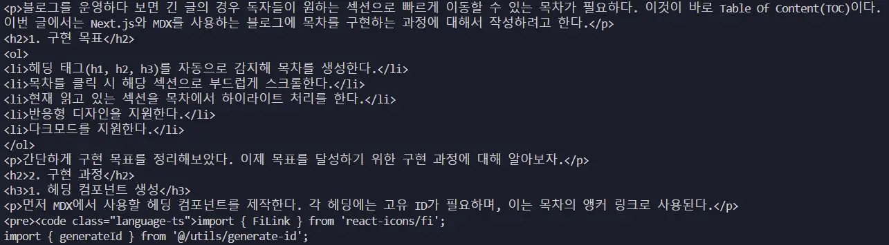

블로그를 운영하다 보면 긴 글의 경우 독자들이 원하는 섹션으로 빠르게 이동할 수 있는 목차가 필요하다. 이것이 바로 Table Of Content(TOC)이다.
이번 글에서는 Next.js와 MDX를 사용하는 블로그에 목차를 구현하는 과정에 대해서 작성하려고 한다.

## 구현 목표

1. 헤딩 태그(h1, h2, h3)를 자동으로 감지해 목차를 생성한다.
2. 목차를 클릭 시 해당 섹션으로 부드럽게 스크롤한다.
3. 현재 읽고 있는 섹션을 목차에서 하이라이트 처리를 한다.
4. 반응형 디자인을 지원한다.
5. 다크모드를 지원한다.

간단하게 구현 목표를 정리해보았다. 이제 목표를 달성하기 위한 구현 과정에 대해 알아보자.

## 구현 과정

### 1. 헤딩 컴포넌트 생성

먼저 MDX에서 사용할 헤딩 컴포넌트를 제작한다. 각 헤딩에는 고유 ID가 필요하며, 이는 목차의 앵커 링크로 사용된다.

```ts
import { FiLink } from 'react-icons/fi';
import { generateId } from '@/utils/generate-id';

interface HeadingProps {
  as: 'h1' | 'h2' | 'h3';
  children: React.ReactNode;
  className?: string;
}

const Heading = ({ as: Component, children, className }: HeadingProps) => {
  const id = generateId(children);

  return (
    <Component id={id} className={className}>
      <a href={`#${id}`} className="group inline-flex items-center gap-2">
        {children}
        <FiLink
          className="text-gray-600 opacity-0 transition-opacity duration-300 group-hover:opacity-100 dark:text-gray-300"
          size={16}
        />
      </a>
    </Component>
  );
};

export default Heading;
```

사실 이 컴포넌트는 포스팅 내부에서 헤딩을 클릭 시 해당 섹션으로 스크롤되도록 제작했다. 이제 이 헤딩에는 고유 ID가 부여되며, 이 ID를 이용해 목차의 앵커 링크를 생성한다.
`children`은 헤딩에 해당하는 텍스트가 된다.


고유 ID가 부여된 헤딩의 사진이다.

### 2. ID 생성 유틸리티 함수

헤딩 텍스트로부터 URL 친화적인 ID를 생성하는 함수가 필요하다.

```ts
export function generateId(text: string): string;
export function generateId(text: React.ReactNode): string | undefined;
export function generateId(text: string | React.ReactNode): string | undefined {
  if (typeof text !== 'string') return undefined;

  return text
    .toLowerCase()
    .replace(/[^a-z0-9가-힣\s]/g, '') // 특수문자 제거
    .replace(/\s+/g, '-') // 공백을 하이픈으로 변환
    .replace(/-+/g, '-') // 연속된 하이픈을 하나로
    .replace(/^-|-$/g, ''); // 시작과 끝의 하이픈 제거
}
```

포스팅을 대부분 한글로 작성하다 보니 한글 지원을 위해 정규식에 '가-힣' 범위까지 포함했다.

### 3. 헤딩 추출 함수

MDX 컨텐츠에서 헤딩을 추출해야 한다. 해당 글에서 velite가 반환하는 `content`를 사용해 헤딩을 추출해야 한다.



위는 해당 포스팅에서 `content`를 출력한 것이다. 보면 `h1`, `h2`, `h3` 태그가 포함되어 있다. 이를 추출하는 함수를 작성해보자.

```ts
export const extractHeadings = (
  content: string,
): { id: string; text: string; level: number }[] => {
  // JSX/HTML 태그에서 헤딩 추출을 위한 정규식
  const headingRegex = /<h([1-3])>([^<]+)<\/h[1-3]>/g;
  const headings = [];
  let match;

  while ((match = headingRegex.exec(content)) !== null) {
    const level = parseInt(match[1]);
    const text = match[2].trim();

    const id = generateId(text);

    headings.push({
      id,
      text,
      level,
    });
  }

  return headings;
};
```

이 함수는 `content`에서 각 헤딩 태그를 추출해 `id`, `text`, `level`을 반환한다.


결과값을 추출해서 확인하면 위처럼 결과가 나온다.

### 4. 헤딩 감지 커스텀 훅

헤딩을 감지하는 커스텀 훅을 만들어 page에 적용할 것이다. `useHeadingObeserver`라는 커스텀 훅을 만들어서 TOC의 핵심 로직을 분리했다.
이 훅은 현재 화면에 보이는 헤딩을 감지하고, 클릭 시 해당 위치로 스크롤하는 기능을 담당한다.

여기서 **Intersection Observer API**를 사용해 특정 요소가 뷰포트와 교차하는 것을 감지한다.

```ts
const callback: IntersectionObserverCallback = entries => {
  // 1. 스크롤 중 불필요한 업데이트 방지
  if (isScrolling) return;

  // 2. 화면에 보이는 헤딩 필터링
  const visibleHeadings = entries.filter(entry => {
    const boundingRect = entry.boundingClientRect;
    return entry.isIntersecting && boundingRect.top;
  });

  // 3. 보이는 헤딩이 있을 경우 처리
  if (visibleHeadings.length > 0) {
    // 4. 위치 기반 정렬
    const sortedVisibleHeadings = visibleHeadings.sort(
      (a, b) => a.boundingClientRect.top - b.boundingClientRect.top,
    );
    // 5. 가장 위에 있는 헤딩 활성화
    const activeHeading = sortedVisibleHeadings[0];
    setActiveId(activeHeading.target.id);
  }
};
```

이 커스텀 훅의 핵심 로직은 위와 같다.

```ts
if (isScrolling) return;
```

위 코드는 스크롤 중 불필요한 업데이트를 방지하기 위한 코드이다. 목차 클릭 시 스크롤하는 동안 다른 헤딩이 활성화되는 것을 방지한다.

```ts
const visibleHeadings = entries.filter(entry => {
  const boundingRect = entry.boundingClientRect;
  return entry.isIntersecting && boundingRect.top;
});
```

위 코드는 화면에 보이는 헤딩을 필터링하는 코드이다. `isIntersecting`은 요소가 뷰포트와 교차하는지 여부를 나타내며, `boundingClientRect.top`은 요소의 상단이 뷰포트의 상단과 얼마나 떨어져 있는지를 나타낸다.

```ts
const sortedVisibleHeadings = visibleHeadings.sort(
  (a, b) => a.boundingClientRect.top - b.boundingClientRect.top,
);
```

화면에 보이는 여러 헤딩 중 가장 위에 있는 헤딩을 찾기 위한 오름차순 정렬을 했다. `boundingRect.top` 값이 작을수록 화면 상단에 가까운 헤딩이다.

```ts
const activeHeading = sortedVisibleHeadings[0];
setActiveId(activeHeading.target.id);
```

정렬된 헤딩 중 첫 번째 헤딩을 활성화했고, 해당 헤딩의 ID를 저장해 TOC에서 하이라이트 처리되도록 하였다.

결론적으로 동적 과정은 다음과 같은 순서로 진행된다.

1. 페이지를 스크롤하면 Observer가 헤딩들의 교차 여부를 감지한다.
2. 화면에 보이는 모든 헤딩을 찾아낸다.
3. 그 중 가장 위에 있는 헤딩을 찾아 활성화한다.
4. TOC에서 해당 헤딩이 하이라이트되어 표시된다.

**더욱 자세한 훅의 내용은 [여기](https://github.com/bbjbc/boongranii.dev/blob/main/src/hooks/use-heading-observer.ts)에서 확인할 수 있다.**

### 5. 페이지에서의 적용

이제 이 커스텀 훅을 사용해 TOC을 페이지에 적용할 수 있다.

```ts
export default async function Post({ params }: Params) {
  // ... 게시물 데이터 로딩

  const headings = extractHeadings(post.content);

  return (
    <div className="relative">
      <aside className="hidden xl:block">
        <div className="fixed right-[calc(60vw-640px-8rem)] top-[100px] w-56">
          <TableOfContents headings={headings} />
        </div>
      </aside>

      <article className="container">
        {/* ... 게시물 내용 */}
      </article>
    </div>
  );
}
```

`post.content`에서 헤딩을 추출하여 TOC 컴포넌트에 전달한다. 이 TOC 컴포넌트는 각 헤딩을 순회하며 목차를 생성한다.

## 마주쳤던 문제들

**ID 생성 문제**

처음에는 단순히 텍스트를 소문자로 변환하고 공백을 하이픈으로 바꾸는 방식을 사용했었다.
하지만 이는 한글과 특수문자를 처리할 때 문제가 발생했고 이를 결국 정규식으로 보완하여 해결할 수 있었다.

**스크롤 감지 문제**

Intersection Observer의 rootMargin과 threshold 값을 조정하는 과정이 필요했다. 현재 설정한 값이 가장 자연스러운 동작을 보여주는 것 같다.

**성능 문제**

목차 클릭 시마다 DOM 조작과 스크롤 이벤트가 발생하므로 성능 문제가 발생할 수 있다. `useRef`를 사용해 Observer 인스턴스를 관리하고 불필요한 렌더링을 방지할 수 있었다.

## 마무리

기존 블로그에서는 **딸깍**하면 TOC을 바로 표현해주었는데 직접 구현해보니 단순하지 않았고, 스크롤 감지 부분이 꽤나 까다로웠던 부분인 것 같았다.
하지만 이를 통해 블로그에 목차를 구현하는 방법을 배울 수 있었고, 이를 통해 블로그의 사용자 경험을 향상시킬 수 있을 것이라고 생각한다.


위처럼 목차를 클릭 시에도 해당 헤딩으로 부드럽게 스크롤링되며, 스크롤하면서 현재 헤딩 위치를 감지해 하이라이트 처리하는 것을 확인할 수 있다.
