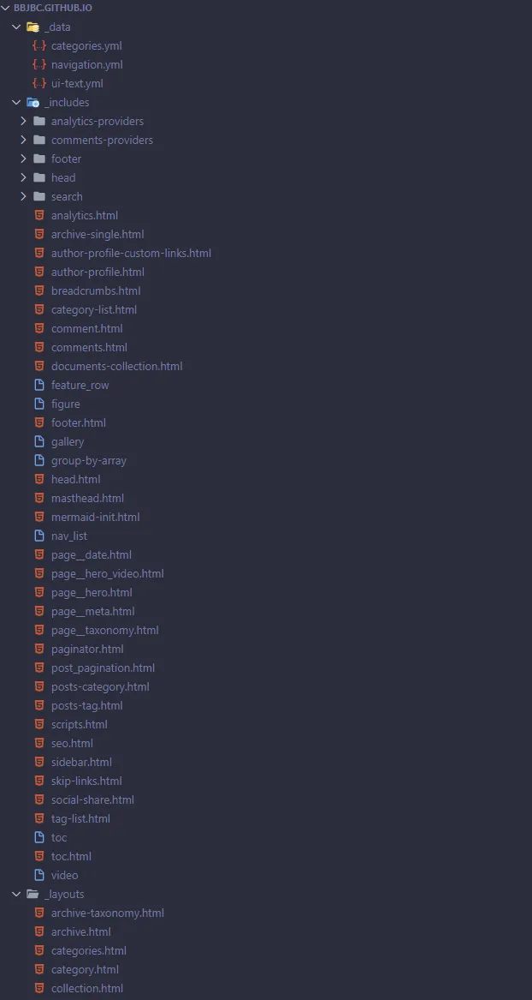
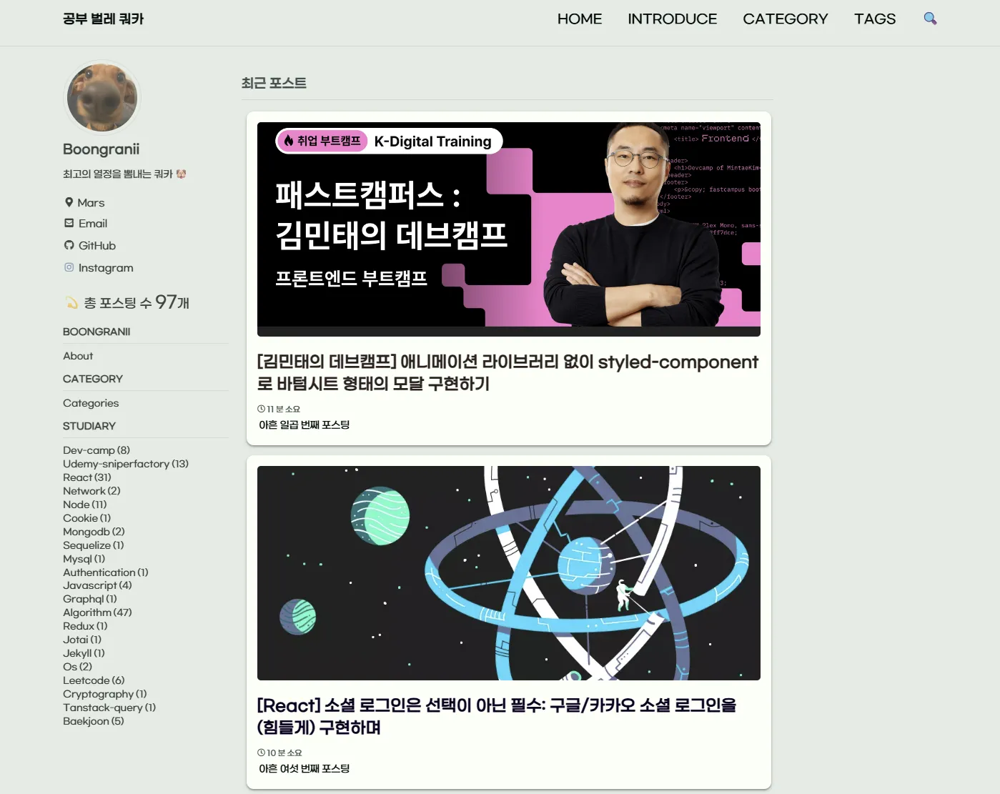
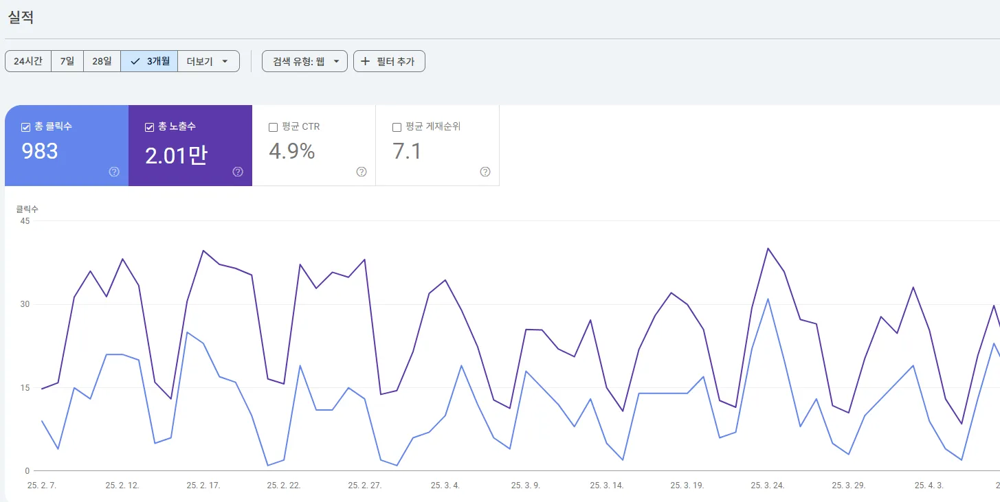
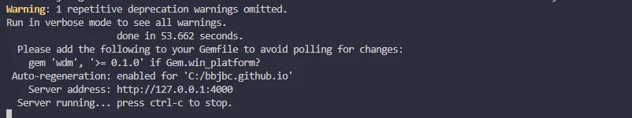
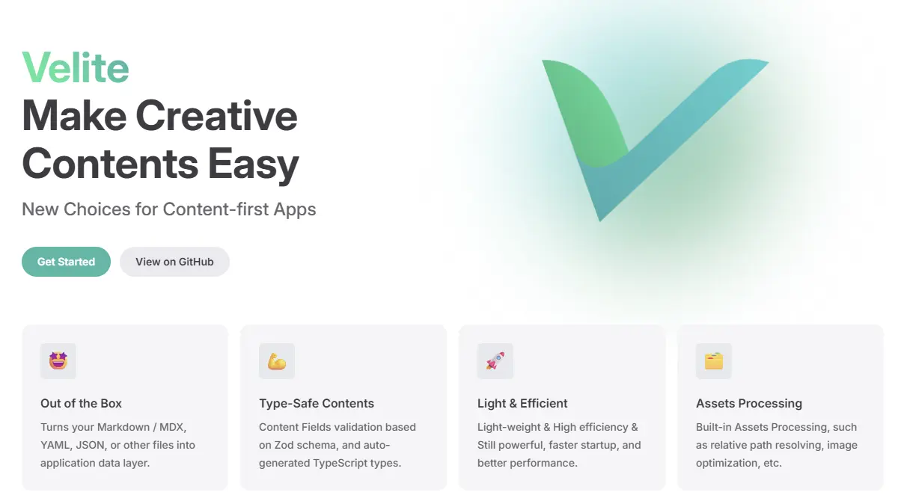
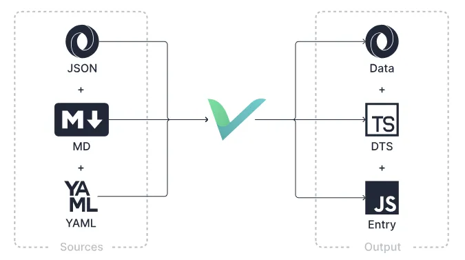
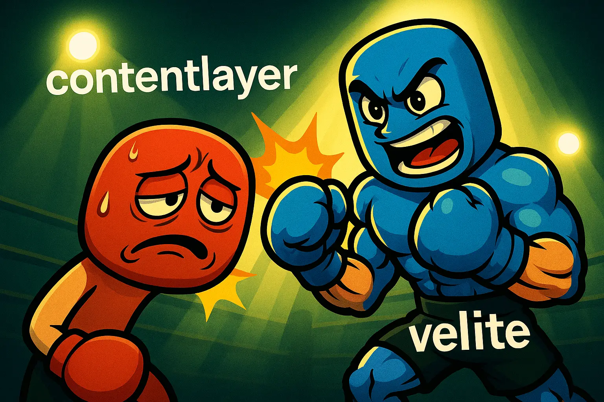
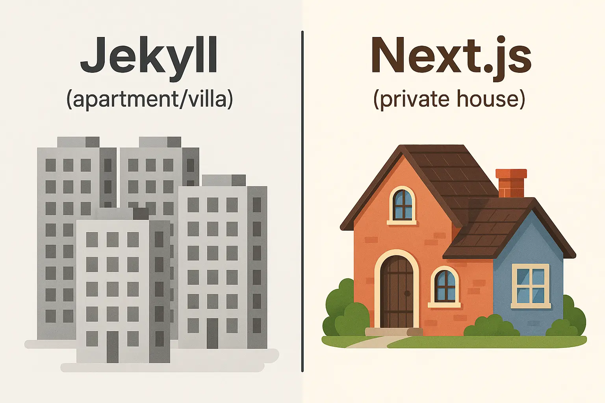

:::warning{title="이보시오, 개발자 여러분!"}
빌드 시간이 무려 **53초**라 하였소? **Jekyll을 더 이상 지킬 수 없는 지경**에 이르렀소. 그러니 **다음 (Next.js)** 을 들라 하노라!
:::

Jekyll 블로그에서 Next.js 기반 블로그로 전환한 경험을 나누려고 해요.
프론트엔드 개발자로서 블로그는 단순한 글쓰기 공간이 아닌, **자신만의 디지털 정원을 가꾸는 과정**이라고 생각해요.
이 여정에서 마주한 도전과 발견에 대해 이야기 해볼게요.

## 기존 Jekyll 블로그

[공부 벌레 쿼카](https://bbjbc.github.io/)라는 이름으로 Jekyll 블로그를 시작했어요.

블로그를 시작하게 된 계기는 아주 자연스러웠어요.
동기가 운영하는 블로그를 보며 "우와 간지난다. 나도 만들어볼까?" 하는 생각이 들었고, 제가 공부하며 배운 내용을 정리해서 다른 개발자들과 공유하고 싶은 마음이 컸거든요.

처음에는 `github.io`를 통해 블로그를 배포하기로 했어요.
아직 개발 실력이 충분하지 않아 처음부터 블로그를 직접 만들기보다는 템플릿을 활용하는 방향으로 결정했죠.
[Jekyll 템플릿 갤러리](http://jekyllthemes.org/)에서 많은 입문자들이 선택하는 [Minimal Mistakes](http://jekyllthemes.org/themes/minimal-mistakes/) 테마를 선택했어요.

처음 봤을 때는 "음... 이게 내가 원하는 디자인은 아닌데..." 라고 생각했지만, 코드를 하나하나 뜯어보며 커스터마이징하는 과정이 의외로 재미있었어요.
블로그를 내 취향대로 꾸미는 재미에 푹 빠졌어요.



기존 템플릿은 정말 **수많은 파일**들로 구성되어 있었어요.
커스터마이징을 위해서는 "이 파일은 뭐하는 건지?", "이 코드는 어떤 부분을 담당하는 건지?" 하나하나 클릭해가며 파악해야 했죠... 😑

그래도 조금씩 구조를 이해해가면서 어떤 파일을 수정해야 원하는 변화가 생기는지 감이 잡히기 시작했어요.
가장 어려웠던 부분은 Jekyll에서 사용하는 **Liquid 템플릿 언어**에 적응하는 것이었어요.

:::info{title="Liquid란?"}
[Liquid](https://shopify.github.io/liquid/)는 Shopify에서 개발한 오픈 소스 템플릿 언어로, Jekyll에서 HTML 파일을 동적으로 생성하기 위해 사용해요.
:::

이 Liquid 문법은 블로그에 페이지네이션을 추가하거나, 포스트 목록을 표시하거나, 조건에 따라 다른 콘텐츠를 보여주는 등의 동적 요소를 구현할 때 필수적이었어요.
처음 보는 문법에 당황스러워서 GPT의 도움을 받고 공식 문서를 수없이 찾아보며 커스터마이징했던 날들이 생생해요. 😄

이런 낯선 문법과 복잡한 구조가 나중에 Next.js와 같은 React 기반 프레임워크로 전환하게 된 주요 이유 중 하나였답니다.



수많은 시행착오 끝에 **귀엽고 개성 넘치는 블로그**를 완성했어요! 첫 블로그이자 정성을 들여 커스터마이징한 공간이라 특별한 애착이 생겼죠.
블로그를 시작했을 때는 React 입문 단계였기 때문에, 수강하던 React 강의 내용을 정리하며 첫 포스팅을 시작했어요. ㅎ\_ㅎ

그리고 처음부터 중요하게 생각했던 것! 바로 **SEO 최적화**였어요.
"내 글이 구글에 검색되면 얼마나 좋을까?" 하는 마음으로 `sitemap.xml`과 `robots.txt`를 작성하고, Google Analytics도 연동했죠.
열심히 설정하고 기다리던 그 시간이 아직도 새록새록하네요!



그 결과, 총 게시글 **90+**, 총 클릭수 **900+**, 총 노출수 **20,000+** 라는 놀라운 성과를 달성했고, 평균 게재순위도 무려 **7위**를 기록했어요!
꾸준히 글을 작성하고, `sitemap.xml`을 업데이트하고, 색인을 생성하는 등 정성을 들인 노력이 이런 결과로 돌아온 것 같아 보람찼습니다. ㅎㅎ

## 미친듯이 느린 빌드 속도

하지만, 이 정이 들었던 블로그를 놔줘야 할 때가 되었다고 생각했어요.



게시글이 90개가 넘어가니 빌드 시간이 기하급수적으로 늘었어요.
**53초**나 기다려야 게시글을 로컬 환경에서 확인할 수 있다니, 정말 답답했어요.
항상 서버를 껐다 키면 50초가 넘는 시간을 기다리면서 딴짓을 해야 했죠. 창작의 흐름이 끊기는 순간도 있었죠.

이러한 불편함이 블로그를 새로 만들어야겠다고 느낀 가장 큰 이유였어요. 그 외에도

1. 위에서 설명했던 어렵고 복잡한 **Liquid 커스텀 문제**
2. 수많은 파일을 하나하나 까봐야 하는 **번거로움**
3. 내 블로그인데도 **내 마음대로** 바꾸기 어려운 제한적인 환경

이런 점들을 고려하면서 "정말 이 템플릿 환경에서 계속 작성해야 할까?" 하는 의문이 들었죠.

그래서 저는 블로그를 이사하기로 결심했어요.
지금까지의 게시글도 물론 이사할 수 있었지만, 지금까지의 게시글은 현재 블로그에 잘 아카이브 시켜 두고 새로운 환경에서 더 효율적이고 자유롭게 글을 써내려가고자 했어요.

## 새로운 블로그

이런 답답함이 쌓이면서 자연스럽게 새 블로그를 만들어야겠다는 생각을 했어요.

프론트엔드 개발자라면 누구나 한 번쯤은 꿈꿔봤을 **'나만의 블로그 만들기'** 프로젝트를 시작할 수 있었던 때였어요.
내 마음대로 커스텀할 수 있고 처음부터 블로그 환경을 구축한다는 생각에 설레기도 했어요.
디자인은 어떻게 할지도 많이 고민했고 여러 블로그를 보며 영감을 받았어요.

하지만 블로그는 단순한 개인 프로젝트와는 달랐어요.
SEO에 최적화되어 Google 검색에 잘 노출되어야 했고, 방문자들에게 좋은 사용자 경험을 제공해야 했어요.
이러한 요구사항을 고려했을 때, Next.js는 자연스러운 선택이었어요.

이 당시, 찾아보니 Next.js로 블로그를 만들고자 했던 사람이 엄청 많았던 것 같아요.
다양한 예제와 블로거들 덕분에 생각보다 진입 장벽이 높지 않았고, 개발 과정에서 막히는 부분도 다른 개발자들의 경험을 참고할 수 있어 든든했어요.

## 기술 스택 정하기

블로그 제작에 앞서 기술스택을 선정해보았어요.

**1. 프레임워크: [Next.js](https://nextjs.org/)**

Next.js는 프로젝트로 사용해본 경험이 없었어요.
하지만 이번 기회를 통해서 Next.js에 가까워지고자 했어요.
**SEO 최적화**에 유리하고 서버에서 정적인 콘텐츠를 미리 렌더링해 사용자에게 보여주기 때문에, 로딩 화면 없이 빠른 페이지 전환이 가능해 **사용자 경험이 훨씬 향상**될 것이라고 생각했어요.

요즘 가장 핫한 프론트엔드 프레임워크이기도 하고, 블로그를 새로 만드는 개발자들 대부분이 Next.js를 선택하는 추세였어요. 특히 **app router**를 경험해보고 공부해보고 싶어서 Next.js를 선택했답니다.

---

**2. CSS: [Tailwind CSS](https://tailwindcss.com/)**

최근 Styled-components가 유지보수 모드에 들어가면서 Tailwind CSS는 점점 더 인기를 얻고 있어요.
저는 Tailwind CSS 환경이 굉장히 편하고, 지금까지 대부분의 프로젝트에서 이 방식으로 스타일링을 해왔기 때문에 익숙하고 효율적이라고 느꼈어요.

Jekyll에서 사용하던 SCSS 대신 Tailwind CSS로 디자인하니 원하는 방향으로 **빠르게 UI를 구현**할 수 있었고, 디자인도 일관되게 유지하기도 쉬웠답니다.

---

**3. 게시글: [MDX](https://mdxjs.com/)**

이전 블로그나 Notion, GitHub README 작성을 하며 이미 익숙해진 마크다운 문법을 사용했어요.
MDX는 마크다운에 **JSX 컴포넌트**를 추가로 사용할 수 있어서, 훨씬 더 확장성 있는 커스터마이징이 가능했어요.

이 덕분에 일반 마크다운으로는 불가능한 **인터랙티브한 요소**나 **커스텀 UI 컴포넌트**를 글 안에 자유롭게 넣을 수 있게 되었죠!

---

**4. 댓글: [Giscus](https://giscus.app/ko)**

Giscus는 utterances에서 영감을 받은 댓글 서비스예요. GitHub Discussions 기반으로 작동해요.

기존 블로그에서는 [utterances](https://utteranc.es/)를 사용했었지만, 이번에는 더 많은 개발 블로그에서 채택하고 있는 Giscus로 전환했어요.
utterances는 유지보수가 꽤 오래전에 중단된 반면, Giscus는 **최근까지 활발하게 유지보수**가 이루어지고 있었거든요.
게다가 디자인도 더 모던하고 깔끔해서 블로그 전체 분위기와도 잘 어울렸답니다.

---

**5. 배포: [Vercel](https://vercel.com/)**

정적 웹사이트와 서버리스 함수를 손쉽게 배포하고 관리할 수 있는 클라우드 플랫폼인 Vercel을 선택했어요.
프론트엔드 프로젝트 배포가 정말 **간단하고 직관적**이라는 점이 매력적이었죠. GitHub 레포지토리만 연동하면 **CI/CD 파이프라인이 자동으로 구성**되어 코드 푸시만으로 배포가 완료되니까요!

이번 블로그 프로젝트의 또 다른 목표 중 하나는 **개인 도메인을 구매해서 연결**하는 것이었는데, Vercel에서는 이 과정도 클릭 몇 번으로 쉽게 설정할 수 있었어요.

또한 방문자 유입이 늘어날수록 중요해지는 **페이지 분석 기능**도 Vercel Analytics와 Vercel Speed Insights를 통해 한 곳에서 관리할 수 있어서 사이트 성능과 사용자 행동을 실시간으로 모니터링하기에 완벽했답니다.

## 콘텐츠 관리: Velite

Next.js 블로그를 만들 때 콘텐츠 관리는 **핵심 요소**예요.
많은 Next.js 블로거들이 [ContentLayer](https://contentlayer.dev/)를 사용하지만, 저는 [Velite.js](https://velite.js.org/)를 선택했어요.



Velite.js는 다양한 소스 형식(JSON, MD, YAML)을 데이터, TypeScript 타입 정의, JavaScript 엔트리로 변환해주는 **강력한 콘텐츠 변환 도구**예요.



이 다이어그램을 보면 Velite.js가 어떻게 작동하는지 한눈에 이해할 수 있어요. 왼쪽의 다양한 소스 파일들(JSON, MD, YAML)을 오른쪽의 데이터(Data), TypeScript 정의(DTS), JavaScript 엔트리(JS Entry)로 변환해주죠.

간단히 말하면, 우리가 작성한 마크다운 글이나 JSON 데이터를 **타입이 완벽하게 갖춰진 JavaScript 객체**로 변환해서 Next.js에서 쉽게 사용할 수 있게 해주는 거예요!

### Contentlayer 대신 Velite를 선택한 이유



처음에는 대부분의 사람들이 사용하는 Contentlayer를 살펴봤어요.
그러다 GitHub에서 팔로우하던 분이 Velite에 star를 해둔 것을 우연히 발견했고, 구글링을 통해 Velite를 선택한 다른 블로거들의 경험담도 읽게 되었어요.

호기심에 Velite를 자세히 알아보게 되었고, 아래와 같은 장점들이 저를 사로잡았어요.

**1. 활발한 유지보수**: Contentlayer는 유지보수가 중단된 상태였지만, Velite는 **지속적인 업데이트와 개선**이 이루어지고 있었어요.

**2. 유연한 확장성**: Velite는 다양한 커스텀 로더와 훅을 통해 **자유롭게 확장**할 수 있었어요. 블로그를 계속 발전시켜 나가고 싶었던 저에게는 이 점이 매우 중요했죠.

**3. Zod 기반 타입 검증**: Zod를 활용한 **강력한 타입 시스템**으로 콘텐츠 구조를 명확하게 정의하고 관리할 수 있었어요. 오타나 구조적 오류를 빌드 시점에 미리 잡아낼 수 있어 안정적이었죠.

**4. 명확한 에러 메시지**: 문제가 발생했을 때 이해하기 쉬운 **친절한 오류 메시지**를 제공해서 디버깅이 훨씬 수월했어요.

### Velite의 추가적인 장점

Velite의 공식 문서에서도 강조하는 여러 핵심 특징들이 있었어요.

- **직관적인 사용법**: `content` 폴더에 콘텐츠를 넣고, 스키마를 정의한 후, Velite를 실행하기만 하면 끝! 애플리케이션에서 바로 타입이 완벽한 데이터를 사용할 수 있었어요.
- **완벽한 타입 안전성**: Zod와 TypeScript의 조합으로 **타입 오류 없는** 개발 경험을 제공했어요.
- **프레임워크 독립성**: 특정 프레임워크에 종속되지 않는 출력 방식으로, 필요하다면 Next.js 외의 다른 환경에서도 사용할 수 있는 유연성이 있었어요.
- **가벼운 구조**: 불필요한 의존성 없이 **경량화된 설계**로 빠른 빌드 속도를 보장했어요.
- **풍부한 기능**: 마크다운/MDX 처리부터 이미지 최적화까지, 블로그에 필요한 **모든 기능이 내장**되어 있었어요.
- **커스터마이징 자유도**: 입출력 디렉토리부터 로더, 훅까지 모든 것을 **내 마음대로 조정**할 수 있었죠.

Next.js와 Velite의 조합은 제가 꿈꾸던 **개발자 친화적이면서도 사용자 경험이 뛰어난** 블로그를 만드는 데 완벽한 솔루션이었어요. Jekyll 블로그에서 경험했던 느린 빌드 시간과 복잡한 커스터마이징 과정은 이제 과거의 일이 됐죠!

### Velite의 편리함

Velite의 **가장 큰 매력**은 콘텐츠 관리가 놀라울 정도로 간편하다는 점이었어요.
특히 `content` 폴더에 마크다운 파일만 넣어두면 알아서 처리해주는 방식이 정말 직관적이고 편리했어요.

Velite는 빌드할 때마다 자동으로 **타입 정의 파일을 생성**해 주는데, 이게 정말 신기했어요.

```tsx
import type __vc from '../velite.config.ts';

type Collections = typeof __vc.collections;

export type Post = Collections['posts']['schema']['_output'];
export declare const posts: Post[];

export type Note = Collections['notes']['schema']['_output'];
export declare const notes: Note[];
```

이렇게 자동 생성된 타입과 데이터는 다른 파일에서 한 줄로 임포트해서 바로 사용할 수 있었어요.

```tsx
import { type Post, type Note, posts, notes } from '~content';

export const getSortedPosts = (): Post[] => {
  return posts.sort(
    (a, b) => new Date(b.date).getTime() - new Date(a.date).getTime(),
  );
};

export const getSortedNotes = (): Note[] => {
  return notes.sort(
    (a, b) => new Date(b.date).getTime() - new Date(a.date).getTime(),
  );
};
```

이렇게 만든 유틸리티 함수는 컴포넌트에서 바로 사용해 **블로그 페이지를 손쉽게 구현**할 수 있었죠.

```tsx
export default function Notes() {
  const notes = getSortedNotes();

  return (
    <>
      <header>
        <Title>스치는 기록들</Title>
      </header>
      <ul className="flex w-full flex-col gap-6">
        {notes.map(note => (
          <NoteItem key={note.slug} note={note} />
        ))}
      </ul>
    </>
  );
}
```

이처럼 타입스크립트의 강력한 타입 안전성과 간결한 코드로 개발 과정 전체가 정말 쾌적했어요.
Zod를 통한 데이터 검증 덕분에 오류는 초기에 발견되고, 타입 힌트까지 완벽하게 제공되어 개발자 경험이 정말 좋았어요!

## 블로그 구조와 커스터마이징의 자유로움

직접 블로그를 제작하면서 가장 즐거웠던 점은 **모든 것을 내 마음대로 만들 수 있는 자유**였어요.
특히 다양한 페이지를 원하는 목적에 맞게 구성할 수 있었죠.

- **Home**: 나를 소개하는 공간으로, 간략한 자기소개와 SNS 링크, 그리고 제가 만든 글귀를 넣어 방문자들에게 첫인상을 전달하는 페이지로 디자인했어요.
- **Posts**: 개발 관련 기술 글이 모이는 메인 섹션으로, 제가 공부하고 배운 내용을 체계적으로 정리하는 공간이에요.
- **Notes**: 마치 일기장처럼 자유롭게 생각과 감정을 기록하는 공간이에요. 개발 외적인 회고나 일상의 느낌을 더 편안하게 써내려갈 수 있는 곳이죠.

**Jekyll에서는 꿈도 못 꿨던 기능들**을 이제는 마음껏 추가할 수 있다는 점이 너무나 매력적이었어요.
콜아웃 박스를 추가하거나, 다크 모드를 구현하거나, 마크다운을 커스텀하는 등의 작업을 자유롭게 할 수 있었어요.
~~(물론 Jekyll에서도 가능하지만, 너무 힘들어요)~~

내가 원하는 디자인과 기능을 **정확히 구현**할 수 있는 이 유연성이야말로 Next.js와 Velite.js 조합의 최고 장점이었답니다.
더 이상 템플릿의 한계에 갇히지 않고, 진정한 '내' 블로그를 만들 수 있게 된 것이 행복해요!

## 내 집 마련

처음에는 디자인 때문에 많이 망설였어요.
"과연 내가 예쁜 블로그를 만들 수 있을까?" 하는 고민이 컸죠.
하지만 여러 개발자분들의 블로그에서 영감을 받으며 **심플하면서도 모던한 느낌**의 블로그를 만들 수 있었답니다.

처음부터 직접 디자인하고 구현하는 과정은 단순한 블로그 제작을 넘어 **웹 개발 역량을 키우는 여정**이었어요.
레이아웃부터 반응형 디자인, 성능 최적화까지 웹 개발의 다양한 측면을 실전에서 경험할 수 있었죠.

Jekyll의 블로그가 '**빌려 쓰는 집**(임대 아파트)'이었다면, Next.js로 만든 새 블로그는 '**직접 지은 집**'이라는 느낌이에요.
기둥부터 지붕까지 내 손으로 만든 공간이니 애정이 더 클 수밖에 없겠죠?



물론 초기에 Velite를 이해하고 여러 오류와 싸우느라 시간이 꽤 걸렸지만, 이제는 **원하는 대로 자유롭게** 공간을 꾸미고 확장할 수 있게 됐어요.
새로운 기능이 필요할 때마다 템플릿의 한계에 부딪히지 않아도 된다는 점이 정말 큰 장점이에요.

블로그는 개발자에게 단순한 기록 공간을 넘어서는 의미가 있어요. 자신의 생각을 정리하고, 배운 지식을 공유하며, **커뮤니티와 소통하는 소중한 창구**예요.
이번 리뉴얼을 통해 더 풍부한 콘텐츠로 더 많은 분들과 소통할 수 있게 되어 정말 기뻐요!

아직은 게시글 수가 많지 않아 방문자와 클릭 수가 이전 블로그보다 현저히 적지만, 앞으로 꾸준히 글을 작성해서 이전 블로그처럼 **클릭수와 노출수를 늘려볼 계획**이에요.

여러분도 블로그 플랫폼에 대해 고민하고 계신다면, 단순히 기술적인 측면만 보지 마시고 **자신의 콘텐츠와 성장 방향에 맞는 도구**를 선택하시길 권해드려요.
새로운 도전은 비록 처음에는 어렵게 느껴질 수 있지만, 그 과정에서 얻는 경험과 성장은 무엇과도 바꿀 수 없는 값진 자산이 될 거예요! 💪

## 참고 블로그

- [Gwansik Kim님 블로그](https://www.gwansik.dev/)
- [wontory님 블로그](https://www.wontory.dev/)
- [김도형님 블로그](https://d5br5.dev/blog)
- [RECODE LOG](https://www.recodelog.com/blog/next/create-blog)
- [이현준님 블로그](https://www.leehyeonjun.com/blog/next_mdx_blog)
- [Velite.js 공식 문서](https://velite.js.org/)

이 외에도 많은 분들의 블로그에서 영감을 받았어요. 좋은 블로그와 글 써주셔서 감사합니다.
