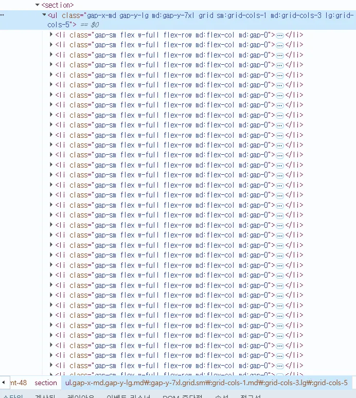
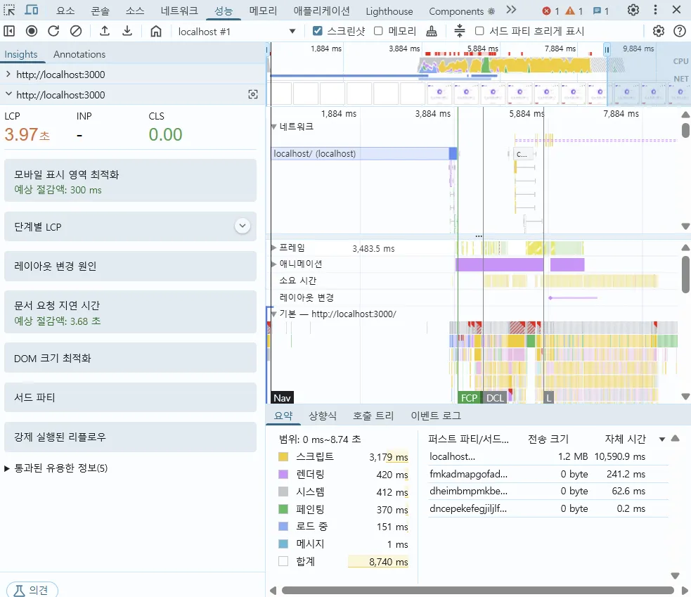
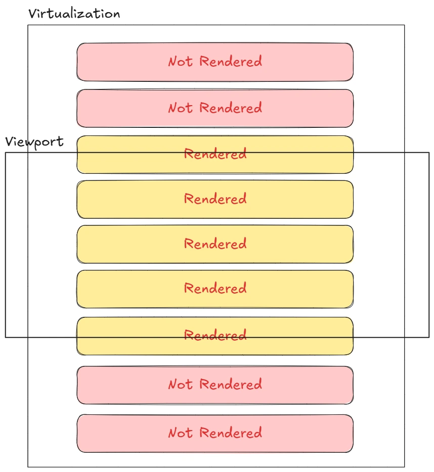
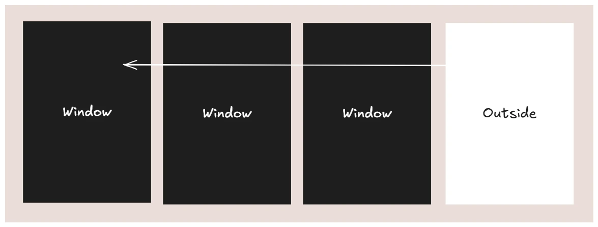
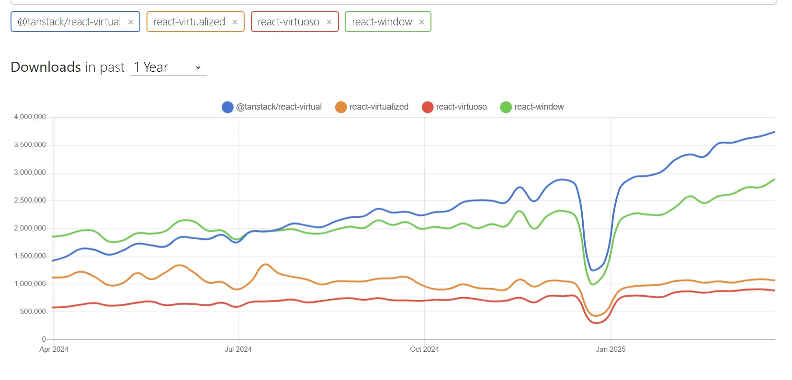
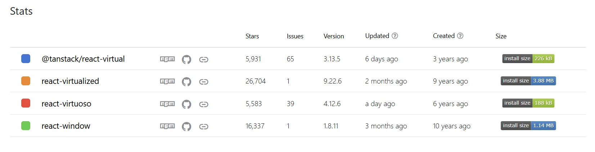
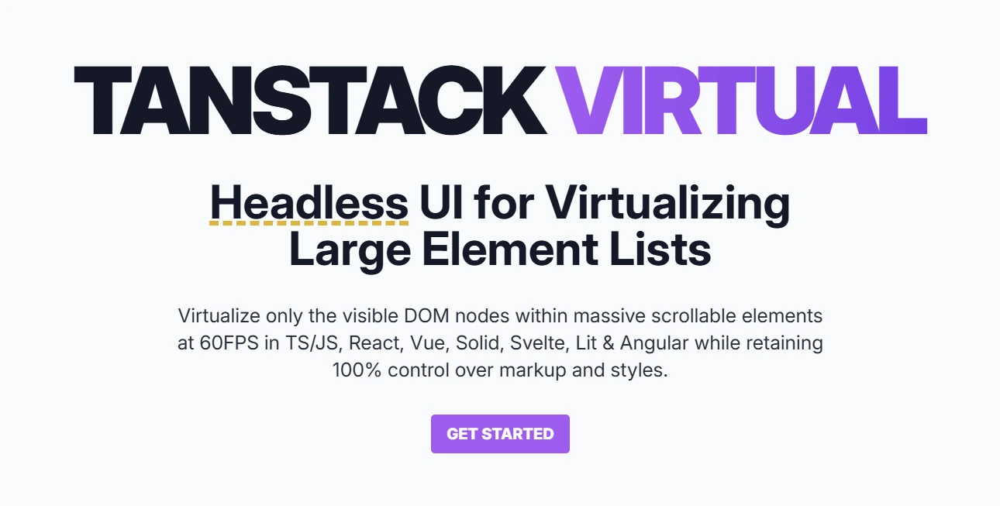
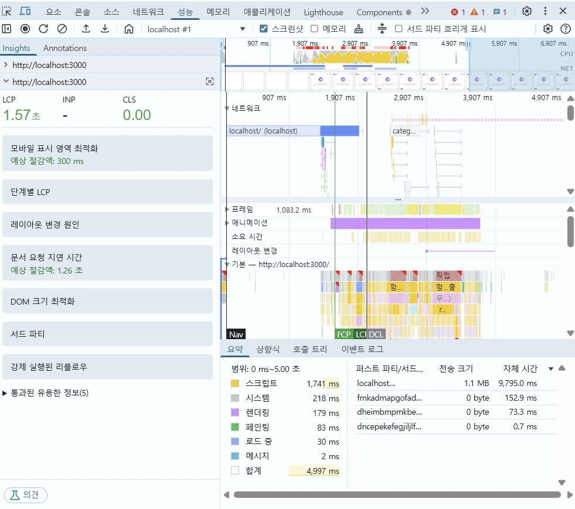
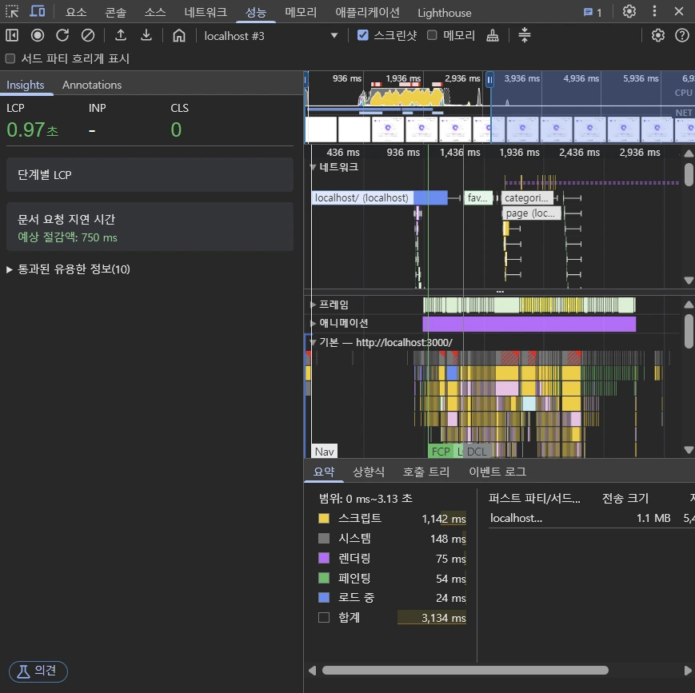

## 현재 문제점

쇼핑몰을 구축하는 과정에서 메인 페이지에 대규모의 상품 목록이 표시되고 있었어요.
이를 구현하기 위해서는 많은 양의 데이터를 서버에서 받아와서 한 번에 브라우저에 그려줘야 해요.

이 과정에서 브라우저는 많은 양의 DOM을 생성하게 되고, 이로 인해 성능 저하가 발생했어요.



위 사진처럼 기존에는 모든 상품이 한 번에 그려지기 때문에 많은 양의 DOM이 생성되었고, 성능이 저하되는 것을 확인했어요.



실제로 크롬 성능 탭을 확인하니 LCP가 무려 3.97초로 측정됐어요.

:::info{title="LCP가 뭔데요?"}
**LCP**란 Largest Contentful Paint의 약자로, **웹 페이지의 주요 컨텐츠가 로드되는 시점을 측정하는 Core Web Vitals의 지표**에요.
이는 사용자가 페이지의 주요 컨텐츠를 볼 수 있게 되는 시간을 말하며 UX에 직접적인 영향을 미쳐요.

Google은 좋은 UX를 위해서는 **LCP가 2.5초 이내**를 권장해요.
:::

실제로 **3.97초**가 기록되다 보니 제가 개발하면서 실제로 화면이 그려지는 데 오랜 시간이 걸려 답답함을 느꼈어요.

## 스크롤에 따라 그려지는 목록

쇼핑몰 개발을 하기 위해서 여러 커머스 사이트를 참고하다 보니 신기한 점을 발견했어요.


위처럼 **[오늘의 집](https://store.ohou.se/)** 사이트에서는 상품 목록을 스크롤할 때마다 뷰포트에 보이는 상품만 그려지는 것을 확인했어요.
정말 신기하지 않나요? ~~너무 신기해서 꼭 구현해보고 싶었어요.~~

이것이 무엇인지 궁금해서 찾아보니 **가상화(Virtualization)** 라는 기술이었어요!

## 가상화에 대해서

가상화는 대규모의 데이터를 효율적으로 렌더링하기 위한 기술로 사용자의 화면에 실제로 보이는 항목만 DOM에 렌더링하는 방식이에요.



위 그림처럼 뷰포트에 보이는 영역이 변경됨에 따라서 필요한 요소만 동적으로 렌더링하고 화면 밖으로 벗어난 요소는 DOM에서 제거해서 메모리와 렌더링 성능을 최적화할 수 있어요.

쇼핑몰 상품 목록 특성 상 이미지가 많고 상품 데이터가 많이 있어서 최적화를 고려해보는 계기가 됐어요!



창문에서 밖을 바라볼 때 창문이 열린 부분만 보이고 나머지 부분은 보이지 않는 것과 비슷해요.
그래서 windowing 기법이라고도 불려요. ~~창문을 스르륵 윈도잉~하는 느낌이랄까 몽말알?~~

## 라이브러리 선택

저는 사실 `tanstack/react-virtual`과 `react-window` 라이브러리에 대해서는 들어봤어요.
찾아보니까 되게 다양하게 있더라구요.

목록 가상화를 쉽게 할 수 있는 라이브러리는 여러 종류가 있었어요.

- [Tanstack Virtual](https://tanstack.com/virtual/v3)
- [react-virtualized](https://www.npmjs.com/package/react-virtualized?ref=retool-blog.ghost.io)
- [react-window](https://www.npmjs.com/package/react-window)
- [react-virtuoso](https://virtuoso.dev/)



위 [npm trends](https://npmtrends.com/@tanstack/react-virtual-vs-react-virtualized-vs-react-virtuoso-vs-react-window)에서 볼 수 있듯이 `@tanstack/react-virtual`이 압도적으로 인기 있는 라이브러리였어요.



위는 스탯을 비교한 결과에요.
모듈 크기가 가장 작은 것은 `react-virtuoso`였어요. 유지보수가 가장 최신에 이루어진 것도 마찬가지죠.

`react-virtualized`와 `react-window`는 만들어진 지 오래된 라이브러리기도 하고 모듈 크기도 다른 것에 비해 상당히 커서 배제하기로 했어요.

모듈 크기도 작았고 다운로드 수도 많고, 가장 트렌디하고 더 커지고 있는 `Tanstack`을 택하기로 했어요.



현재 프로젝트에서 `Tanstack Query`를 사용하고 있었기 때문에 이와 시너지가 좋을 것으로 예측했어요.
또한, 예시와 공식 문서도 엄청 잘 나와 있어서 적용하기 편할 거라고 생각했어요.

## 가상화 적용하기

```tsx
return (
  <section>
    <ul className="...">
      {productItems.map((item: Product) => (
        <ProductItem key={item.productId} {...item} />
      ))}
    </ul>
  </section>
);
```

기존 코드는 모든 상품을 한 번에 렌더링하는 방식이었어요.

이 코드를 가상화 라이브러리를 사용해서 뷰포트에 보이는 상품만 렌더링하도록 변경해보려고 해요.

```tsx
const useProductListVirtualizer = ({ products }: { products: Product[] }) => {
  // 반응형에 따른 레이아웃 구성
  const [layoutConfig, setLayoutConfig] = useState(
    PRODUCT_LIST_LAYOUT_CONFIG.desktop,
  );

  // 상품 목록을 행 단위로 그룹화
  const groupedRows = useMemo(() => {
    const rowData = [];
    const { columns } = layoutConfig;

    for (let i = 0; i < products.length; i += columns) {
      rowData.push(products.slice(i, i + columns));
    }
    return rowData;
  }, [products, layoutConfig]);

  // 가상화 설정
  const rowVirtualizer = useWindowVirtualizer({
    count: groupedRows.length,
    estimateSize: () => layoutConfig.estimatedSize,
    overscan: layoutConfig.overscan,
    gap: layoutConfig.gap,
  });

  const virtualRows = rowVirtualizer.getVirtualItems();
  const totalSize = rowVirtualizer.getTotalSize();

  return { virtualRows, totalSize, groupedRows, rowVirtualizer };
};
```

가상화 로직을 이 곳 뿐 아니라 다른 곳에서도 사용할 예정이라 가상화 핵심 로직을 담당하는 커스텀 훅을 제작했어요.
상품 목록을 행 단위로 그룹화하고, 화면 크기에 따라 적절한 레이아웃 설정을 적용하죠.

:::info{title="상품 목록을 행 단위로 그룹화에서 'useMemo'를 사용한 이유"}
상품 데이터나 레이아웃 설정이 변경될 때만 그룹화 연산을 다시 수행하고, 그 외의 경우에는 이전에 계산된 결과를 재사용해요.

상품 목록의 크기가 크거나 그룹화 로직이 복잡할수록 불필요한 계산을 방지하는 것이 중요한 것 같아요.
이를 통해서 리렌더링 시 발생할 수 있는 지연을 최소화하고 부드러운 스크롤 경험을 유지할 수 있어요.
:::

```tsx
const handleResize = useCallback(() => {
  const width = window.innerWidth;

  if (width < 768) {
    setLayoutConfig(PRODUCT_LIST_LAYOUT_CONFIG.mobile);
  } else if (width < 1024) {
    setLayoutConfig(PRODUCT_LIST_LAYOUT_CONFIG.tablet);
  } else {
    setLayoutConfig(PRODUCT_LIST_LAYOUT_CONFIG.desktop);
  }
}, []);

useEffect(() => {
  handleResize();

  let resizeTimer: NodeJS.Timeout;

  const debouncedResizeHandler = () => {
    clearTimeout(resizeTimer);
    resizeTimer = setTimeout(handleResize, 100);
  };

  window.addEventListener('resize', debouncedResizeHandler);
  return () => {
    window.removeEventListener('resize', debouncedResizeHandler);
    clearTimeout(resizeTimer);
  };
}, [handleResize]);
```

리사이즈 이벤트에 디바운싱을 적용해서 불필요한 리렌더링을 방지했어요.

여기서 `useWindowVirtualizer`를 사용한 이유는 쇼핑몰 특성 상 window 기반의 스크롤을 사용하기 때문이에요.

:::note{title="그러면 useVirtualizer는 언제 사용해요?"}
`useVirtualizer`는 특정 DOM 요소 내부의 스크롤을 관리할 때 적합해요.
결론적으로는 페이지 내에 여러 개의 독립된 스크롤 영역이 필요한 경우에 사용하죠.

[코드로 보는 차이점](https://tanstack.com/virtual/latest/docs/framework/react/react-virtual#usewindowvirtualizer)은 여기를 참고해주세요!
:::

```tsx
return (
  <section className="relative">
    <div
      style={{
        height: `${totalSize}px`,
        width: '100%',
        position: 'relative',
      }}
    >
      {virtualRows.map(virtualRow => {
        const rowIndex = virtualRow.index;
        const rowItems = groupedRows[rowIndex];

        return (
          <div
            key={virtualRow.key}
            data-index={virtualRow.index}
            ref={rowVirtualizer.measureElement}
            style={{
              position: 'absolute',
              top: 0,
              left: 0,
              width: '100%',
              transform: `translateY(${virtualRow.start}px)`,
              height: `${virtualRow.size}px`,
            }}
          >
            <ul className="gap-x-md grid sm:grid-cols-1 md:grid-cols-3 lg:grid-cols-5">
              {rowItems.map((item: Product) => (
                <ProductItem key={item.productId} {...item} />
              ))}
            </ul>
          </div>
        );
      })}
    </div>
  </section>
);
```

위 코드는 가상화를 적용한 컴포넌트 렌더링 구조에요.
여기서 **인라인 CSS 스타일을 사용한 이유**는 가상화에서 필요한 동적 값을 정확하게 처리하기 위해서에요.

가상화는 픽셀 단위의 정확한 위치 계산이 필요해서 Tailwind CSS로 작성할 경우 우선순위가 상대적으로 높은 인라인 스타일에 의해 덮어 씌워질 수 있어요.
따라서 **동적인 위치 지정과 크기 조절에 적합한 인라인 스타일을 사용**했어요.

가상 행 렌더링은 `virtualRows`를 통해 현재 화면에 보이는 행만 포함하고, 각 행은 `transfrom: translateY` 속성을 사용해서 절대 위치로 배치돼 정확한 위치에 렌더링돼요.

측정 시스템은 `ref={rowVirtualizer.measureElement}`를 사용해서 각 행의 크기를 측정하고, `style={{ height: ${virtualRow.size}px }}`를 통해 정확한 높이를 설정해요.
이를 통해서 동적 높이를 지원해서 행마다 다른 높이를 가질 수 있는 것이죠.

```tsx
export const PRODUCT_LIST_LAYOUT_CONFIG = {
  mobile: { columns: 1, estimatedSize: 200, gap: 24, overscan: 10 },
  tablet: { columns: 3, estimatedSize: 424, gap: 80, overscan: 5 },
  desktop: { columns: 4, estimatedSize: 504, gap: 80, overscan: 4 },
};
```

레이아웃 설정은 디바이스별 최적화된 경험을 위해 중요해요.

모바일에서는 한 행에 1개 상품만 표시해서 더 작은 `estimatedSize`와 `gap`을 사용하고, 태블릿과 데스크톱에서는 더 많은 상품을 한 행에 배치해서 더 큰 간격을 사용해요.
`estimatedSize`는 직접 콘솔에 찍어서 해당 행의 높이를 측정해서 넣어줬어요. 사이즈에 맞지 않게 넣는다면 스크롤이 부자연스러워질 수 있고 화면에 보이는 상품이 겹쳐 보일 수 있어요.

`overscan`값은 사용자 경험을 위한 중요한 설정이에요. 이는 화면 밖에 추가로 렌더링할 항목 수를 나타내서 빠른 스크롤 시에 부드러운 경험을 제공하기 위해 적절하게 설정해줘야 해요.

## 가상화 적용 결과

이제 가상화를 적용한 결과를 확인해볼까요?


현재 뷰포트에 들어오는 행부터 `overscan`까지의 범위까지 DOM에 렌더링되는 것을 확인할 수 있어요.



가상화를 적용하고 나니 **LCP가 3.97초에서 1.57초로 무려 2.4초나** 줄었어요!
전체적인 페이지 로딩이 약 60% 이상 개선된 것을 확인할 수 있었어요.

## 무한스크롤까지 얹으면?

현재 로직에 무한스크롤까지 얹으면 어떻게 될까요?

위 코드에서 사용했던 API는 모든 상품을 가져오는 API였어요.
아무리 가상화를 적용했어도 초반에 모든 상품을 가져온다면 로딩 시간은 길 수밖에 없을 거예요.

그래서 백엔드 개발자분께 페이지네이션된 API도 요청드려서 `useInifiniteQuery`를 사용해서 무한스크롤을 적용해봤어요.



**가상화만 적용했을 때는 LCP가 1.57초였는데 무한스크롤까지 얹으니 0.97초로 줄었어요!**

당연하게도 초기에 불러오는 데이터 양이 적다보니 로딩 시간이 줄어 LCP가 확연하게 더 줄어든 것을 확인했어요.

## 결론

목록 가상화는 다량의 데이터를 표시해야 하는 웹 애플리케이션에서 필수적인 **최적화 기법**인 것 같아요.

간단하게 **이점**을 정리해보자면 다음과 같아요.

- **불필요한 DOM 렌더링 최소화**
- **메모리 사용량 감소**
- **초기 로딩 시간 단축**
- **스크롤 성능 향상**
- **추가적인 데이터가 생겨도 일관된 성능 유지**

인라인 스타일을 활용한 정확한 위치 계산과 `tanstack/react-virtual`의 `useWindowVirtualizer`를 통해 window 기반의 가상화 구현으로 상품 목록의 성능과 UX를 크게 향상시킬 수 있었어요!

**가상화와 무한스크롤을 적용하기 전인 3.97초에서 적용 후인 0.97초로 무려 3초(75%)나 줄어든 것을 확인하니 정말 뿌듯했어요.**

UI만 고려하는 것이 아닌 UX까지 고려하는 개발자가 되기 위해서 계속해서 노력해야겠어요!
