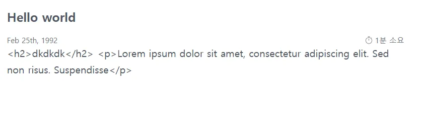
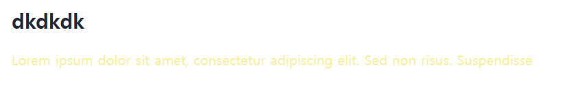

## 1. 문제 상황

Next.js와 Velite를 사용하여 블로그를 개발하던 중에 MDX 콘텐츠를 렌더링하는 과정에서 예상치 못한 문제가 발생했다.

```md
---
title: Hello world
subTitle: 간단한 소개입니다1
image: './image1.png'
slug: hello-world
date: 1992-02-25 13:22
---

## dkdkdk

Lorem ipsum dolor sit amet, consectetur adipiscing elit. Sed non risus. Suspendisse
```

MDX 파일 내용은 위와 같다.

이 MDX 파일을 화면에 렌더링했을 때, HTML 태그가 문자 그대로 표시되는 현상이 있었다.



위 사진처럼 태그와 함께 텍스트가 출력되는 것을 볼 수 있다.

이는 `mdx-components.tsx`에 정의해둔 스타일이 전혀 적용되고 있지 않는 것이었다.

```ts
import type { MDXComponents } from 'mdx/types';

export function useMDXComponents(components: MDXComponents): MDXComponents {
  return {
    ...components,
    // 스타일 적용 내용
  };
}
```

### 주의 사항

`mdx-components.tsx` 파일의 위치도 중요하다.

- pages 또는 app 디렉토리와 같은 레벨
- src 디렉토리를 사용하는 경우 src 디렉토리 내부

```bash
your-project/
├── app/
│   └── page.tsx
├── mdx-components.tsx  ✅ 옵션 1
└── src/
    └── mdx-components.tsx  ✅ 옵션 2
```

이는 MDX 컴포넌트들이 전역적으로 적용되기 위해 필요한 컨벤션이다.

## 2. 원인 분석

Velite를 통해 생성된 데이터를 콘솔에 출력해보니 post에 대한 객체는 아래와 같은 구조를 갖고 있었다.

```js
{
  title: 'Hello world',
  slug: 'hello-world',
  date: '1992-02-25T04:22:00.000Z',
  subTitle: '간단한 소개입니다1',
  image: {
    src: '/static/image1-f8e0c686.png',
    height: 720,
    width: 1280,
    blurDataURL: 'data:image/webp;base64,UklGRjIAAABXRUJQVlA4ICYAAACwAQCdASoIAAUADMDOJbACsADx4igAAMlZM/aTPnrdMR5OSR+cAA==',
    blurWidth: 8,
    blurHeight: 5
  },
  metadata: { readingTime: 1, wordCount: 13 },
  code: 'const{Fragment:n,jsx:e,jsxs:t}=arguments[0];function _createMdxContent(r){const s={h2:"h2",p:"p",...r.components};return t(n,{children:[e(s.h2,{children:"dkdkdk"}),"\\n",e(s.p,{children:"Lorem ipsum dolor sit amet, consectetur adipiscing elit. Sed non risus. Suspendisse"})]})}return{default:function(n={}){const{wrapper:t}=n.components||{};return t?e(t,{...n,children:e(_createMdxContent,{...n})}):_createMdxContent(n)}};',
  content: '<h2>dkdkdk</h2>\n' +
    '<p>Lorem ipsum dolor sit amet, consectetur adipiscing elit. Sed non risus. Suspendisse</p>',
  permalink: '/post/hello-world'
}
```

콘솔에서 확인할 수 있듯이

- content: 일반 HTML 문자열
- code: JSX 변환을 위한 실행 가능한 함수 문자열

이렇게 나타나고 있다.

처음에는 단순히 `post.content`를 렌더링하려 했지만 이는 HTML 문자열을 그대로 출력하는 결과를 가져왔다. 실제로 필요한 것은 `post.code`를 활용해 React 컴포넌트로 변환하는 작업이었다.

## 3. 문제 해결 과정

이를 해결하기 위해 여러 시행착오가 있었다. 관련 블로그글도 없었다.
~~(스포: next 공식 문서만 살펴보다 뒤늦게 velite 공식 문서를 봤는데 해결책이 등장..)~~

### 1차 시도: 직접 렌더링

처음에 시도했던 방법이다. `{post.content}`를 통한 렌더링을 시도했다. 이는 HTML 태그 자체가 문자열로 출력되어 실패했다.

### 2차 시도: velite.config.js 수정

MDX 처리 방식을 변경하기 위해 Velite 설정을 수정했다.

```ts
import { defineConfig, s } from 'velite';

export default defineConfig({
  collections: {
    posts: {
      name: 'Post',
      pattern: 'posts/**/*.mdx', // .md를 .mdx로 변경
      schema: s
        .object({
          title: s.string(),
          slug: s.slug('posts'),
          date: s.isodate(),
          video: s.file().optional(),
          subTitle: s.string(),
          image: s.image().optional(),
          metadata: s.metadata(),
          content: s.mdx({
            // s.markdown() 대신 s.mdx() 사용
            jsx: true,
          }),
        })
        .transform(data => ({ ...data, permalink: `/post/${data.slug}` })),
    },
  },
});
```

먼저 파일의 확장자를 `.md`에서 `.mdx`로 변경했다. 내 파일의 확장자는 `.mdx`.

그리고 `content` 필드의 처리를 `s.mdx()`로 변경해주었다. 마크다운과 jsx를 한 번에 제공하는 mdx로 바꿔주었는데도 이 방법 조차 실패했다.
여전히 HTML 태그가 문자열로 표시되고 제대로 동작하지도 않았다.

Velite의 MDX 처리 결과물이 예상대로 나오지 않아서 결국 `post.code`로 해결해보기로 했다.

### 3차 시도: MDXContent 컴포넌트 생성

그래서 `post.code`를 활용하는 MDXContent 컴포넌트를 만들었다.

```ts
export default function MDXContent({ code }: MDXContentProps) {
  const Component = () => {
    const fn = new Function(code);
    const { default: MDXComponent } = fn();
    return MDXComponent;
  }

  return <Component />;
}
```

> ⨯ SyntaxError: Unexpected token `<` at new Function

그랬더니 위와 같은 에러가 발생했다. JSX 코드를 문자열로 직접 실행하려 해서 그렇다.

### 4차 시도: useMDXComponents 분리와 공식 문서 활용

계속해서 next.js+mdx의 공식 문서만 살펴 보고 이와 관련한 블로그도 존재하지 않아서 Velite의 공식 문서를 읽어봤다.

너무 잘 나와 있었다.. ~~역시 공식 문서를 잘 읽어보자..~~

[Velite: using-mdx](https://velite.js.org/guide/using-mdx)

> **jsx-runtime이 뭔데?** <br /> `jsx-runtime`은 JSX 변환 방식을 제공하는 패키지이다.
> 이는 `React.createElement`를 직접 호출하지 않고도 JSX를 효율적으로 변환할 수 있게 해준다.

```ts
import * as runtime from 'react/jsx-runtime'

const sharedComponents = {
  // Add your global components here
}

// parse the Velite generated MDX code into a React component function
const useMDXComponent = (code: string) => {
  const fn = new Function(code)
  return fn({ ...runtime }).default
}

interface MDXProps {
  code: string
  components?: Record<string, React.ComponentType>
}

// MDXContent component
export const MDXContent = ({ code, components }: MDXProps) => {
  const Component = useMDXComponent(code)
  return <Component components={{ ...sharedComponents, ...components }} />
}
```

이 코드를 참고했다.

```ts
import * as runtime from 'react/jsx-runtime';

import { useMDXComponents } from './mdx-components';

const useMDXComponent = (code: string) => {
  const fn = new Function(code);
  return fn({ ...runtime }).default;
};

interface MDXProps {
  code: string;
}

export const MDXContent = ({ code }: MDXProps) => {
  const components = useMDXComponents({});
  const Component = useMDXComponent(code);
  return <Component components={components} />;
};
```

이렇게 하고나서 동적 컴포넌트에

```js
<MDXContent code={post.code} />
```

이렇게 사용하니 오류 없이 정상적으로 렌더링 되는 것을 확인할 수 있었다.

useMDXComponents는 async 함수 내에서 사용할 수 없었기에 MDXContent 컴포넌트에서 사용했다.

`runtime` 객체를 직접 전달해서 MDX 컴파일된 코드가 필요로 하는 JSX 변환 함수들을 제공해주었다.

### new Function은 왜?

Velite가 생성한 `post.code`의 내용은 아래와 같다.

```js
const{Fragment:n,jsx:e,jsxs:t}=arguments[0];function _createMdxContent(r){...}
```

1. 위 코드는 문자열 형태의 JavaScript 코드였다.
2. React runtime의 JSX 변환 함수들을 필요로 한다.
3. MDX 컴포넌트를 생성하는 함수를 포함한다.

위 코드는 이러한 특징을 갖는다.

이러한 코드를 실행 가능한 React 컴포넌트로 변환하기 위해서는 **문자열을 실행 가능한 함수로 변환해야 한다.** 여기서 `new Function`을 사용하면 된다.

## 4. 결론



위와 같이 태그가 아닌 마크다운의 형태로 렌더링이 되는 것을 확인할 수 있다.

Velite가 반환했던 `post.code`의 형태를 유심히 살펴보며 이를 실행 가능하도록 해야했고 이를 React runtime으로 해결했어야 했다.

진작에 Velite의 공식 문서를 제대로 읽었다면 이러한 시행착오가 없었을텐데, 각 접근 방식의 한계와 문제점을 이해할 수 있었다.
