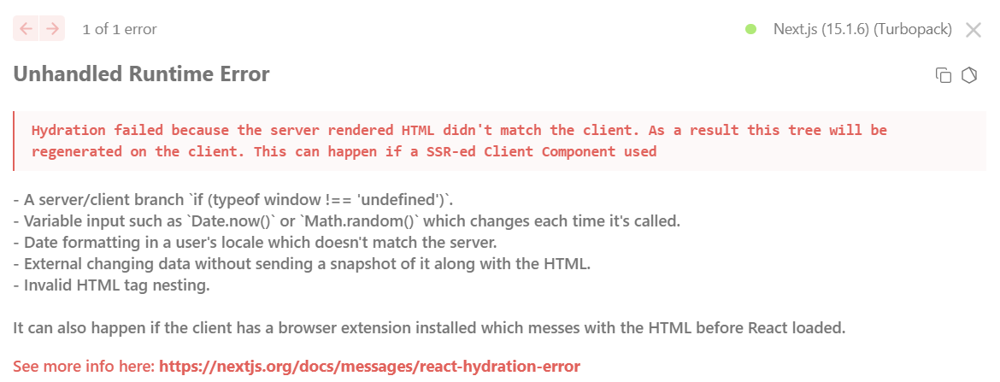
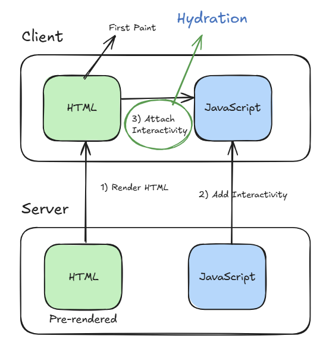

## 1. Hydration이 뭔데?

> **hydration**이란 **서버에서 렌더링된 정적 HTML에 JavaScript의 상호작용을 추가하는 과정**을 말한다.
> Next.js는 초기에 서버에서 HTML을 생성하고, 클라이언트에서 이 HTML에 이벤트 핸들러와 상태를 연결한다.

## 2. 문제 상황

[next-themes](https://ui.shadcn.com/docs/dark-mode/next)를 사용해서 다크모드를 구현하고 있었다.



갑자기 대문짝만한 에러가 발생했다; 매우 당황.

next-themes를 사용해 다크모드를 구현할 때 다음(혹은 위)과 같은 hydration 에러가 발생할 수 있다.

```bash
Uncaught Error: Hydration failed because the initial UI does not match what was rendered on the server.
```

위 에러는 서버에서 렌더링된 HTML과 클라이언트에서 렌더링하려는 컴포넌트의 내용이 일치하지 않을 때 발생한다.

## 3. 발생 원인



발생 원인은 **간단하게 말해서 렌더링하려는 것의 불일치** 때문이다.

SSR 과정에서 서버는 사용자의 테마 설정이나 선호도를 알 수 없는 상태로 초기 HTML을 생성한다. 서버는 단순히 기본 상태의 HTML을 생성해 클라이언트에 전달할 뿐이다.

반면, 클라이언트는 브라우저의 localStorage에 저장된 이전 테마 설정이나 사용자의 시스템 환경 설정을 확인할 수 있다. 이로 인해서 클라이언트는 이러한 정보들을 바탕으로 실제 테마를 결정하고 렌더링을 시도한다.
결과적으로 서버에서 생성된 초기 HTML과 클라이언트에서 실제로 렌더링하려는 UI 사이에 불일치가 발생하게 된다.

이러한 렌더링 타이밍의 차이가 문제를 악화시킬 수 있다.
서버는 테마 정보 없이 먼저 렌더링을 수행하고 이후에 클라이언트에서는 테마 정보를 확인 후 렌더링을 시도한다.
이 과정에서 React는 서버에서 생성된 HTML과 클라이언트에서 생성하려는 **컴포넌트의 내용이 서로 다르다는 것을 감지하고 Hydration 오류를 발생시키게 된다.**

## 4. 해결 방법

> **suppressHydrationWarning 사용**

첫 번째 방법은 `layout`에 있는 `html` 태그에 `suppressHydrationWarning` 속성을 추가하는 방법이 존재한다.

```ts
export default function RootLayout({
  children,
}: {
  children: React.ReactNode;
}) {
  return (
    <html lang="ko" suppressHydrationWarning>
      <body>
        <ThemeProvider attribute="class" defaultTheme="system" enableSystem>
          {children}
        </ThemeProvider>
      </body>
    </html>
  );
}
```

위처럼 태그에 속성을 추가해주면 된다. 하지만 이는 단순히 경고를 숨기는 것에 불과하다고 한다. 실제 hydration 불일치 문제를 해결하지는 못한다.

실제로도 이 속성만 적용했는데도 hydration 불일치 문제가 계속되어 나도 찾아보았다.

- [Theme Provider creates hydration error in Next.js 15.0.1
  ](https://github.com/shadcn-ui/ui/issues/5552)
- [Using next-themes for dark mode generates hydration failed error](https://stackoverflow.com/questions/77026759/using-next-themes-for-dark-mode-generates-hydration-failed-error)

이렇게 에러로 인해 이슈나 질문을 등록한 사람도 존재한다. 안에 들어가면 해결책들이 나온다.

근본적인 해결 방법은 컴포넌트가 클라이언트에 마운트된 후에만 렌더링되도록 하는 것이다.

> **mounted 상태 체크 추가**

```ts
'use client';

import { useTheme } from 'next-themes';
import { useEffect, useState } from 'react';
import { IoSunnyOutline, IoMoonOutline } from 'react-icons/io5';

const ThemeToggle = () => {
  const { theme, setTheme } = useTheme();
  const [mounted, setMounted] = useState(false);

  useEffect(() => {
    setMounted(true);
  }, []);

  if (!mounted) {
    return null;
  }

  return (
    <button
      onClick={() => setTheme(theme === 'dark' ? 'light' : 'dark')}
      className="rounded-md p-2 hover:bg-gray-100 dark:hover:bg-gray-800"
    >
      {theme === 'dark' ? (
        <IoSunnyOutline size={18} />
      ) : (
        <IoMoonOutline size={18} />
      )}
    </button>
  );
};

export default ThemeToggle;
```

먼저 `useState`를 사용해 `mounted` 상태를 관리하고, `useEffect`를 통해 컴포넌트가 마운트되었을 때 이 상태를 true로 변경하면 된다.
그리고 `mounted`가 false인 경우에는 아무것도 렌더링하지 않도록 처리한다.

이렇게 구현하면 CSR이 완료된 후에만 테마 토글 버튼이 나타나고, 이는 hydration 불일치 문제를 효과적으로 해결할 수 있게 된다.
또한, 테마 전환 시 발생할 수 있는 깜빡임 현상도 방지할 수 있다.

## 5. 권장 사항

내가 생각하는 권장 사항은 두 가지 방법을 모두 적용하는 것이다. 물론, 첫 번째 방법으로 해서 계속되는 hydration 오류를 보았지만.. (그러므로, 두 가지를 적용해야만 하지 않을까..)

RootLayout에서 `suppressHydrationWarning`을 사용하여 불필요한 경고를 제거하고, ThemeToggle 컴포넌트에서는 `mounted` 상태 체크를 통해 실제 hydration 불일치 문제를 해결한다.

조금 코드가 복잡할 수 있지만, 안정적인 다크모드와 더 나은 사용자 경험도 제공할 수 있기에 이러한 방식의 구현은 필수적이라고 생각한다.

## 6. 주의 사항

이 방식을 구현할 때 주의할 점은 `mounted` 상태 체크는 반드시 클라이언트 컴포넌트에서만 사용해야 한다는 것이다. 또한, `useEffect`는 클라이언트 사이드에서만 실행되므로, 서버 사이드 렌더링 시에는 초기 상태인 null이 반환된다.
